# Esquema de BD — Módulo de Listings

> Basado en SRS GTS eStore v5.0  
> Soporta: listing simple · listing con variaciones · eBay · GTS Store · ambos canales · publicación diferida por canal · publicación programada · borradores incompletos · plantillas reutilizables · copia de listings · control de stock con historial completo

---

## Tablas

### `listings` — Listing principal

| Columna | Tipo | Notas |
|---------|------|-------|
| `id` | int | PK |
| `title` | varchar | nullable — draft puede no tener título aún |
| `description` | text | nullable |
| `condition` | enum | nullable — `NEW \| OPEN_BOX \| USED \| REFURBISHED \| PARTS` |
| `listing_type` | enum | `LISTING \| TEMPLATE` |
| `status` | enum | `draft \| ready \| scheduled \| published \| partially_published \| out_of_stock \| unpublished \| inactive` |
| `source_type` | enum | `ORIGINAL \| FROM_TEMPLATE \| FROM_COPY` |
| `source_id` | int | nullable FK → `listings.id` — origen si es copia o desde template |
| `is_variation` | boolean | `false` = single / `true` = con variaciones |
| `shipping_policy` | enum | nullable — `NORMAL \| FREIGHT \| FREE` |
| `fixed_shipping_cost` | decimal | nullable — obligatorio solo para publicar |
| `weight_value` | decimal | nullable |
| `weight_unit` | varchar | nullable — `LB \| OZ \| KG` |
| `dim_length` | decimal | nullable |
| `dim_width` | decimal | nullable |
| `dim_height` | decimal | nullable |
| `dim_unit` | varchar | nullable — `IN \| CM` |
| `has_r2v3_cert` | boolean | |
| `ebay_category_id` | varchar | nullable |
| `ebay_category_name` | varchar | nullable |
| `shared_aspects` | jsonb | nullable — `{ Brand, Model, ... }` |
| `draft_progress` | jsonb | `{ general, category, aspects, variations, images, pricing, shipping, inventory, channels }` |
| `created_by` | int | FK → users |
| `created_at` | timestamp | |
| `updated_at` | timestamp | |

---

### `listing_pricing` — Precio del listing simple

Solo existe cuando `is_variation = false`. Para variaciones el precio vive en `listing_variations`.

| Columna | Tipo | Notas |
|---------|------|-------|
| `id` | int | PK |
| `listing_id` | int | FK único → `listings.id` |
| `sku` | varchar | nullable en draft |
| `base_price` | decimal | nullable en draft — ingresado por el empleado |
| `ebay_discount_pct` | decimal | nullable — snapshot del config al crear |
| `ebay_price` | decimal | nullable — `base_price × (1 − ebay_discount_pct)`, calculado |
| `store_discount_pct` | decimal | nullable — snapshot al crear |
| `store_price` | decimal | nullable — `base_price × (1 − store_discount_pct)`, calculado |

---

### `listing_variation_axes` — Ejes de variación

Solo existe cuando `is_variation = true`. Define qué atributos diferencian las variaciones.

| Columna | Tipo | Notas |
|---------|------|-------|
| `id` | int | PK |
| `listing_id` | int | FK → `listings.id` |
| `aspect_name` | varchar | ej: `Color`, `Storage Capacity`, `RAM` |
| `values` | jsonb | ej: `["Space Gray", "Gold", "Sierra Blue"]` |
| `affects_image` | boolean | `true` → cada variación puede tener imagen propia |
| `sort_order` | int | |

---

### `listing_variations` — Variaciones individuales

Solo existe cuando `is_variation = true`. Cada fila = un SKU con precio propio.

| Columna | Tipo | Notas |
|---------|------|-------|
| `id` | int | PK |
| `listing_id` | int | FK → `listings.id` |
| `sku` | varchar | nullable en draft |
| `label` | varchar | nullable — ej: `256GB / Gold` |
| `aspects` | jsonb | nullable — `{ Color: ["Gold"], Storage: ["256 GB"] }` |
| `base_price` | decimal | nullable en draft |
| `ebay_discount_pct` | decimal | nullable |
| `ebay_price` | decimal | nullable — calculado |
| `store_discount_pct` | decimal | nullable |
| `store_price` | decimal | nullable — calculado |
| `status` | enum | `active \| out_of_stock \| inactive` |
| `sort_order` | int | |

---

### `listing_images` — Imágenes

| Columna | Tipo | Notas |
|---------|------|-------|
| `id` | int | PK |
| `listing_id` | int | FK → `listings.id` |
| `listing_variation_id` | int | nullable FK — `null` = imagen del grupo |
| `original_url` | varchar | URL en servidor privado |
| `ebay_url` | varchar | nullable — resultado de `createImageFromUrl` |
| `gts_store_url` | varchar | nullable |
| `ebay_url_expires_at` | date | nullable — las URLs de eBay expiran |
| `sort_order` | int | |
| `is_primary` | boolean | |

---

### `listing_inventory_links` — Vínculo con inventario del CRM

Cada fila = un ítem físico del CRM vinculado al listing. `UNIQUE` en `crm_inventory_id` — un ítem CRM solo puede pertenecer a un listing.

| Columna | Tipo | Notas |
|---------|------|-------|
| `id` | int | PK |
| `listing_id` | int | FK → `listings.id` |
| `listing_variation_id` | int | nullable FK — `null` = single listing |
| `crm_inventory_id` | int | ID principal en la tabla `inventory` del CRM — UNIQUE |
| `crm_po_id` | varchar | nullable — número de PO en el CRM |
| `crm_po_line` | varchar | nullable — línea de la PO en el CRM |
| `crm_iq_id` | varchar | nullable — identificador IQ en el CRM |
| `crm_warehouse_id` | int | Bodega origen — denormalizado para queries rápidos |

---

### `listing_stock` — Stock actual (snapshot)

Una fila por listing (simple) o por variación. Es el número que se muestra en la UI y el que se envía a eBay/GTS Store como `availableQuantity`.

| Columna | Tipo | Notas |
|---------|------|-------|
| `id` | int | PK |
| `listing_id` | int | FK → `listings.id` |
| `listing_variation_id` | int | nullable FK — `null` = single listing |
| `quantity_available` | int | Stock disponible en este momento |
| `updated_at` | timestamp | |

---

### `listing_stock_movements` — Historial de movimientos (ledger)

Cada cambio de stock genera una fila aquí. El stock actual puede verificarse como `SUM(quantity_delta)`. El snapshot en `listing_stock` y el total del ledger siempre deben coincidir — se actualizan en la misma transacción.

| Columna | Tipo | Notas |
|---------|------|-------|
| `id` | int | PK |
| `listing_id` | int | FK → `listings.id` |
| `listing_variation_id` | int | nullable FK |
| `quantity_delta` | int | `+` entra / `−` sale |
| `quantity_after` | int | Snapshot del stock tras este movimiento |
| `movement_type` | enum | Ver tabla de tipos abajo |
| `channel` | enum | nullable — `EBAY \| GTS_STORE \| MANUAL \| SYSTEM` |
| `reference_id` | varchar | nullable — order ID, transaction ID, etc. |
| `notes` | text | nullable — nota libre |
| `created_by` | int | nullable FK → users — `null` = sistema automático |
| `created_at` | timestamp | |

**Tipos de movimiento:**

| `movement_type` | Cuándo ocurre | Delta |
|-----------------|--------------|-------|
| `INITIAL` | Stock asignado al crear el listing | `+N` |
| `SALE_EBAY` | eBay notifica una venta | `−N` |
| `SALE_GTS_STORE` | GTS Store notifica una venta | `−N` |
| `RETURN_EBAY` | Devolución aprobada en eBay | `+N` |
| `RETURN_GTS_STORE` | Devolución aprobada en GTS Store | `+N` |
| `CANCELLED_SALE` | Venta cancelada antes de enviar | `+N` |
| `MANUAL_ADD` | Empleado agrega stock manualmente | `+N` |
| `MANUAL_REMOVE` | Empleado quita stock (daño, pérdida, etc.) | `−N` |
| `ADJUSTMENT` | Corrección por conteo físico | `±N` |
| `SYNC_EBAY` | eBay reporta stock diferente al registrado | `±N` |
| `SYNC_GTS_STORE` | GTS Store reporta stock diferente | `±N` |
| `LISTING_DEACTIVATED` | Listing desactivado — stock baja a 0 en canales | `−N` |
| `LISTING_REACTIVATED` | Listing reactivado — stock restaurado | `+N` |

---

### `listing_channel_ebay` — Configuración del canal eBay

| Columna | Tipo | Notas |
|---------|------|-------|
| `id` | int | PK |
| `listing_id` | int | FK único → `listings.id` |
| `ebay_linked_account_id` | int | FK → `gobig_ebay_linked_accounts` |
| `ebay_listing_id` | varchar | nullable — devuelto por `publishOffer` |
| `ebay_sku` | varchar | nullable — solo single (`is_variation = false`) |
| `ebay_offer_id` | varchar | nullable — solo single |
| `ebay_inventory_group_key` | varchar | nullable — solo variaciones |
| `ebay_merchant_location_key` | varchar | nullable en draft |
| `ebay_fulfillment_policy_id` | varchar | nullable en draft |
| `ebay_payment_policy_id` | varchar | nullable en draft |
| `ebay_return_policy_id` | varchar | nullable en draft |
| `ebay_store_category_names` | jsonb | Categorías de la tienda eBay del vendedor |
| `ebay_listing_format` | varchar | `FIXED_PRICE` |
| `ebay_listing_duration` | varchar | `GTC` |
| `ebay_listing_description_html` | text | HTML generado |
| `scheduled_at` | timestamp | nullable — fecha programada de publicación |
| `sync_status` | enum | `not_requested \| scheduled \| pending \| success \| failed` |
| `sync_error_message` | text | nullable |
| `published_at` | timestamp | nullable |
| `last_synced_at` | timestamp | nullable |

---

### `listing_channel_ebay_variations` — Datos eBay por variación

Solo existe cuando `is_variation = true`. Cada fila = 1 inventory item + 1 offer en eBay.

| Columna | Tipo | Notas |
|---------|------|-------|
| `id` | int | PK |
| `listing_channel_ebay_id` | int | FK → `listing_channel_ebay.id` |
| `listing_variation_id` | int | FK → `listing_variations.id` |
| `ebay_sku` | varchar | SKU enviado a `PUT /inventory_item/{sku}` |
| `ebay_offer_id` | varchar | offerId devuelto por `POST /offer` |

---

### `listing_channel_gts_store` — Configuración del canal GTS Store

| Columna | Tipo | Notas |
|---------|------|-------|
| `id` | int | PK |
| `listing_id` | int | FK único → `listings.id` |
| `gts_store_product_id` | int | nullable — se llena tras crear en GTS Store |
| `gts_store_slug` | varchar | nullable |
| `gts_store_url` | varchar | nullable |
| `scheduled_at` | timestamp | nullable — fecha programada de publicación |
| `sync_status` | enum | `not_requested \| scheduled \| pending \| success \| failed` |
| `sync_error_message` | text | nullable |
| `published_at` | timestamp | nullable |
| `last_synced_at` | timestamp | nullable |

---

### `price_config` — Config global de precios

Manejada por el superadmin. Los porcentajes se copian como snapshot al listing en el momento de crearlo; cambios futuros no afectan listings existentes.

| Columna | Tipo | Notas |
|---------|------|-------|
| `id` | int | PK |
| `channel` | varchar | `EBAY \| GTS_STORE` |
| `ebay_linked_account_id` | int | nullable — `null` = aplica a todos / id = solo esa cuenta eBay |
| `discount_pct` | decimal | |
| `updated_by` | int | FK → users |
| `updated_at` | timestamp | |

---

## ERD completo

```mermaid
erDiagram

    listings {
        int         id
        varchar     title                   "nullable"
        text        description             "nullable"
        enum        condition               "nullable — NEW|OPEN_BOX|USED|REFURBISHED|PARTS"
        enum        listing_type            "LISTING|TEMPLATE"
        enum        status                  "draft|ready|scheduled|published|partially_published|out_of_stock|unpublished|inactive"
        enum        source_type             "ORIGINAL|FROM_TEMPLATE|FROM_COPY"
        int         source_id               "nullable FK → listings.id"
        boolean     is_variation
        enum        shipping_policy         "nullable — NORMAL|FREIGHT|FREE"
        decimal     fixed_shipping_cost     "nullable"
        decimal     weight_value            "nullable"
        varchar     weight_unit             "nullable — LB|OZ|KG"
        decimal     dim_length              "nullable"
        decimal     dim_width               "nullable"
        decimal     dim_height              "nullable"
        varchar     dim_unit                "nullable — IN|CM"
        boolean     has_r2v3_cert
        varchar     ebay_category_id        "nullable"
        varchar     ebay_category_name      "nullable"
        jsonb       shared_aspects          "nullable"
        jsonb       draft_progress          "{ general, category, aspects, variations, images, pricing, shipping, inventory, channels }"
        int         created_by
        timestamp   created_at
        timestamp   updated_at
    }

    listing_pricing {
        int         id
        int         listing_id              "FK único"
        varchar     sku                     "nullable"
        decimal     base_price              "nullable"
        decimal     ebay_discount_pct       "nullable — snapshot"
        decimal     ebay_price              "nullable — calculado"
        decimal     store_discount_pct      "nullable — snapshot"
        decimal     store_price             "nullable — calculado"
    }

    listing_variation_axes {
        int         id
        int         listing_id
        varchar     aspect_name
        jsonb       values
        boolean     affects_image
        int         sort_order
    }

    listing_variations {
        int         id
        int         listing_id
        varchar     sku                     "nullable"
        varchar     label                   "nullable"
        jsonb       aspects                 "nullable"
        decimal     base_price              "nullable"
        decimal     ebay_discount_pct       "nullable"
        decimal     ebay_price              "nullable"
        decimal     store_discount_pct      "nullable"
        decimal     store_price             "nullable"
        enum        status                  "active|out_of_stock|inactive"
        int         sort_order
    }

    listing_images {
        int         id
        int         listing_id
        int         listing_variation_id    "nullable"
        varchar     original_url
        varchar     ebay_url                "nullable"
        varchar     gts_store_url           "nullable"
        date        ebay_url_expires_at     "nullable"
        int         sort_order
        boolean     is_primary
    }

    listing_inventory_links {
        int         id
        int         listing_id
        int         listing_variation_id    "nullable"
        int         crm_inventory_id        "UNIQUE — ID principal del CRM"
        varchar     crm_po_id               "nullable"
        varchar     crm_po_line             "nullable"
        varchar     crm_iq_id               "nullable"
        int         crm_warehouse_id
    }

    listing_stock {
        int         id
        int         listing_id
        int         listing_variation_id    "nullable"
        int         quantity_available
        timestamp   updated_at
    }

    listing_stock_movements {
        int         id
        int         listing_id
        int         listing_variation_id    "nullable"
        int         quantity_delta          "+ entra / - sale"
        int         quantity_after
        enum        movement_type           "INITIAL|SALE_EBAY|SALE_GTS_STORE|RETURN_EBAY|RETURN_GTS_STORE|CANCELLED_SALE|MANUAL_ADD|MANUAL_REMOVE|ADJUSTMENT|SYNC_EBAY|SYNC_GTS_STORE|LISTING_DEACTIVATED|LISTING_REACTIVATED"
        enum        channel                 "nullable — EBAY|GTS_STORE|MANUAL|SYSTEM"
        varchar     reference_id            "nullable — order ID, etc."
        text        notes                   "nullable"
        int         created_by              "nullable — null = sistema"
        timestamp   created_at
    }

    listing_channel_ebay {
        int         id
        int         listing_id              "FK único"
        int         ebay_linked_account_id
        varchar     ebay_listing_id         "nullable"
        varchar     ebay_sku                "nullable — single"
        varchar     ebay_offer_id           "nullable — single"
        varchar     ebay_inventory_group_key "nullable — variaciones"
        varchar     ebay_merchant_location_key "nullable"
        varchar     ebay_fulfillment_policy_id "nullable"
        varchar     ebay_payment_policy_id  "nullable"
        varchar     ebay_return_policy_id   "nullable"
        jsonb       ebay_store_category_names
        varchar     ebay_listing_format
        varchar     ebay_listing_duration
        text        ebay_listing_description_html
        timestamp   scheduled_at            "nullable — publicación programada"
        enum        sync_status             "not_requested|scheduled|pending|success|failed"
        text        sync_error_message      "nullable"
        timestamp   published_at            "nullable"
        timestamp   last_synced_at          "nullable"
    }

    listing_channel_ebay_variations {
        int         id
        int         listing_channel_ebay_id
        int         listing_variation_id
        varchar     ebay_sku
        varchar     ebay_offer_id
    }

    listing_channel_gts_store {
        int         id
        int         listing_id              "FK único"
        int         gts_store_product_id    "nullable"
        varchar     gts_store_slug          "nullable"
        varchar     gts_store_url           "nullable"
        timestamp   scheduled_at            "nullable — publicación programada"
        enum        sync_status             "not_requested|scheduled|pending|success|failed"
        text        sync_error_message      "nullable"
        timestamp   published_at            "nullable"
        timestamp   last_synced_at          "nullable"
    }

    price_config {
        int         id
        varchar     channel                 "EBAY|GTS_STORE"
        int         ebay_linked_account_id  "nullable — null=global / id=cuenta específica"
        decimal     discount_pct
        int         updated_by
        timestamp   updated_at
    }

    listings                    ||--o|   listing_pricing                  : "1-1 cuando is_variation=false"
    listings                    ||--o{   listing_variation_axes           : "ejes de variación"
    listings                    ||--o{   listing_variations               : "variaciones"
    listings                    ||--o{   listing_images                   : "imágenes del grupo"
    listings                    ||--o{   listing_inventory_links          : "ítems físicos del CRM"
    listings                    ||--o{   listing_stock                    : "stock actual"
    listings                    ||--o{   listing_stock_movements          : "historial de stock"
    listings                    ||--o|   listing_channel_ebay             : "config eBay"
    listings                    ||--o|   listing_channel_gts_store        : "config GTS Store"
    listings                    }o--o|   listings                         : "source_id → listing origen"

    listing_variations          ||--o{   listing_images                   : "imagen propia por variación"
    listing_variations          ||--o{   listing_inventory_links          : "ítems físicos por variación"
    listing_variations          ||--o|   listing_stock                    : "stock por variación"
    listing_variations          ||--o{   listing_stock_movements          : "historial por variación"
    listing_variations          ||--o{   listing_channel_ebay_variations  : "offer eBay"

    listing_channel_ebay        ||--o{   listing_channel_ebay_variations  : "una por variación"
```



---

## Máquina de estados

```
LISTING:
  draft               → ready               (formulario completo)
  ready               → scheduled           (usuario asigna fecha futura)
  ready               → published           (publicación inmediata)
  scheduled           → ready               (usuario cancela la programación)
  scheduled           → published           (worker ejecuta en la fecha)
  scheduled           → partially_published (worker publica algunos canales)
  published           → out_of_stock        (stock llega a 0)
  published           → unpublished         (empleado despublica)
  out_of_stock        → published           (stock repuesto)
  any                 → inactive

TEMPLATE:
  draft → ready
  (nunca puede llegar a scheduled, published, partially_published, out_of_stock, unpublished)
```

---

## Validaciones por capa

### Al guardar (status = `draft`)
- Ningún campo es obligatorio salvo `listing_type` y `created_by`

### Al marcar como `ready` o publicar
- `title`, `condition`, `shipping_policy`, `fixed_shipping_cost` — NOT NULL
- Al menos 1 imagen
- Al menos 1 inventario vinculado *(solo LISTING, no TEMPLATE)*
- Al menos 1 canal seleccionado *(solo LISTING, no TEMPLATE)*
- Si `shipping_policy = NORMAL` → `weight_value` NOT NULL
- Si `is_variation = true` → al menos 2 variaciones con SKU y precio
- Si canal eBay → `ebay_category_id`, `ebay_merchant_location_key` y las 3 policies NOT NULL

### Al programar (asignar `scheduled_at`)
- `status` debe ser `ready`
- `scheduled_at` debe ser fecha futura
- `listing_type` debe ser `LISTING`

### Al intentar publicar un TEMPLATE
- Error: *"Las plantillas no se pueden publicar. Crea un listing desde esta plantilla."*

### Stock
- `quantity_after` nunca puede ser negativo
- `listing_stock` y `listing_stock_movements` se actualizan en la **misma transacción**
- Si `quantity_available = 0` → actualizar `status` de variación o listing a `out_of_stock`

---

## Estructura por tipo de listing

### Listing simple (`is_variation = false`)

```
listings (1 fila)
├── listing_pricing (1 fila)
├── listing_images (N filas — listing_variation_id = null)
├── listing_inventory_links (N filas — listing_variation_id = null)
├── listing_stock (1 fila — listing_variation_id = null)
├── listing_channel_ebay (1 fila)
│   ├── ebay_sku
│   └── ebay_offer_id
└── listing_channel_gts_store (1 fila)
```

No tiene: `listing_variation_axes`, `listing_variations`, `listing_channel_ebay_variations`

### Listing con variaciones (`is_variation = true`)

```
listings (1 fila — el grupo)
├── listing_variation_axes (N filas — ej. Color + Storage)
├── listing_variations (N filas — ej. Gray/128, Gray/256, Gold/128…)
│   ├── listing_images (opcional — imagen propia)
│   ├── listing_inventory_links (N filas)
│   └── listing_stock (1 fila por variación)
├── listing_images (N filas de grupo — listing_variation_id = null)
├── listing_channel_ebay (1 fila)
│   ├── ebay_inventory_group_key
│   └── listing_channel_ebay_variations (N filas — ebay_sku + ebay_offer_id por variación)
└── listing_channel_gts_store (1 fila)
```

No tiene: `listing_pricing`

### Template (`listing_type = TEMPLATE`)

```
listings (1 fila)
├── listing_variation_axes (opcional)
├── listing_variations (opcional — estructura, sin inventario)
├── listing_images (opcional)
├── listing_pricing (opcional)
```

No tiene: `listing_inventory_links`, `listing_stock`, `listing_stock_movements`, `listing_channel_ebay`, `listing_channel_gts_store`

---

## Flujo de publicación eBay (referencia cruzada con `00-listing-creation-flow.md`)

### Single listing
```
1. PUT /sell/inventory/v1/inventory_item/{sku}
2. POST /sell/inventory/v1/offer
3. POST /sell/inventory/v1/offer/{offerId}/publish
```

### Con variaciones
```
1. N × PUT /sell/inventory/v1/inventory_item/{sku}
2. PUT /sell/inventory/v1/inventory_item_group/{groupKey}
3. N × POST /sell/inventory/v1/offer
4. POST /sell/inventory/v1/offer/publish_by_inventory_item_group
```

El worker de publicación programada llama al mismo `EbayOrchestratorService` — no hay lógica duplicada.

---

## Mapeo de campos con la API de eBay

| Campo en BD | API de eBay | Endpoint |
|-------------|-------------|----------|
| `listing_images.ebay_url` | Media API | `POST /commerce/media/v1_beta/image/create_image_from_url` |
| `listings.ebay_category_id` | Taxonomy API | `GET /category_tree/0/get_category_suggestions` |
| `listings.shared_aspects` | Taxonomy API | `GET /category_tree/0/get_item_aspects_for_category` |
| `listing_channel_ebay.ebay_fulfillment_policy_id` | Sell Account API | `GET /sell/account/v1/fulfillment_policy` |
| `listing_channel_ebay.ebay_payment_policy_id` | Sell Account API | `GET /sell/account/v1/payment_policy` |
| `listing_channel_ebay.ebay_return_policy_id` | Sell Account API | `GET /sell/account/v1/return_policy` |
| `listing_channel_ebay.ebay_merchant_location_key` | Sell Inventory API | `GET /sell/inventory/v1/location` |
| `listing_channel_ebay.ebay_sku` / `listing_channel_ebay_variations.ebay_sku` | Sell Inventory API | `PUT /sell/inventory/v1/inventory_item/{sku}` |
| `listing_channel_ebay.ebay_inventory_group_key` | Sell Inventory API | `PUT /sell/inventory/v1/inventory_item_group/{key}` |
| `listing_channel_ebay_variations.ebay_offer_id` | Sell Inventory API | `POST /sell/inventory/v1/offer` |
| `listing_channel_ebay.ebay_listing_id` | Sell Inventory API | `POST /sell/inventory/v1/offer/{id}/publish` |
| `listing_stock.quantity_available` | Sell Inventory API | Campo `availableQuantity` en el payload de inventory item |
