# Esquema de BD — GTS eStore (Schema Final Consolidado)

> Basado en SRS GTS eStore v5.0  
> Combina: Módulo de Listings/Catálogo · Módulo Compradores/Órdenes  
> Soporta: listing simple · variaciones · eBay · GTS Store · multi-bodega · carrito guest · checkout Stripe · ShipEngine · devoluciones manuales

> **PKs:** `uuid v7` en todas las tablas internas — ordenado por tiempo, sin fragmentación de índice, no enumerable en API.  
> **FKs externas** (`crm_*`, `ebay_linked_account_id`, `crm_warehouse_id`) mantienen `int` porque referencian tablas de otros sistemas.

---

## Módulo 1 — Listings y Catálogo

---

### `listing_conditions` — Condiciones GTS Grade (RF-CAT-009)

Tabla CMS gestionada por admins CRM. Almacena el contenido display de cada nivel de condición (Excellent / Good / Fair) — descripción, puntaje de referencia y token de color UI. El listing sigue guardando `condition` como enum (`EXCELLENT | GOOD | FAIR`), **sin FK** a esta tabla.

| Columna | Tipo | Notas |
|---------|------|-------|
| `id` | uuid | PK |
| `code` | varchar(20) | UNIQUE NOT NULL — `EXCELLENT \| GOOD \| FAIR` — clave lógica inmutable |
| `label` | varchar(100) | NOT NULL — etiqueta de display: `Excellent`, `Good`, `Fair` |
| `score` | int | NOT NULL — puntaje de referencia UI: `95`, `75`, `55` (informativo, no se guarda en listing) |
| `ui_color` | varchar(20) | NOT NULL — token de color UI: `green`, `blue`, `amber` |
| `description` | text | NOT NULL — descripción resumida del nivel |
| `sort_order` | int | default 0 |
| `is_active` | boolean | default `true` |
| `updated_by` | int | nullable — ID admin CRM |
| `created_at` | timestamp | NOT NULL |
| `updated_at` | timestamp | NOT NULL |

> **Índices:** `code` (UNIQUE), `(is_active, sort_order)`.  
> **Seed fijo:** 3 filas con UUIDs constantes (`44444444-0000-0000-0000-00000000000{1,2,3}`). No se crean ni eliminan desde la API — solo se actualizan.

---

### `gts_categories` — Categorías internas GTS Store

Categorías planas (sin anidamiento) para agrupar listings en la tienda. No se eliminan — se desactivan para no romper FKs existentes.

| Columna | Tipo | Notas |
|---------|------|-------|
| `id` | uuid | PK |
| `name` | varchar | Ej: `Laptops`, `Desktops`, `Phones` |
| `is_active` | boolean | `false` = desactivada, mantiene FKs |
| `sort_order` | int | Orden de presentación. Gestionado vía endpoint de reorder, no editable manualmente |
| `icon` | varchar(100) | nullable — nombre del ícono de [HugeIcons](https://hugeicons.com) para el storefront |
| `image` | varchar(500) | nullable — URL de imagen de portada de la categoría para el storefront |
| `created_at` | timestamp | |
| `updated_at` | timestamp | |

---

### `listings` — Listing principal

| Columna | Tipo | Notas |
|---------|------|-------|
| `id` | uuid | PK |
| `title` | varchar | nullable — draft puede no tener título aún |
| `description` | text | nullable |
| `condition` | enum | nullable — `EXCELLENT \| GOOD \| FAIR` (GTS Grade visible al cliente — RF-CAT-009) |
| `listing_type` | enum | `LISTING \| TEMPLATE` |
| `status` | enum | `draft \| ready \| scheduled \| published \| partially_published \| out_of_stock \| unpublished \| inactive` |
| `source_type` | enum | `ORIGINAL \| FROM_TEMPLATE \| FROM_COPY` |
| `source_id` | uuid | nullable FK → `listings.id` — origen si es copia o desde template |
| `is_variation` | boolean | `false` = single / `true` = con variaciones |
| `gts_category_id` | uuid | nullable FK → `gts_categories.id` — categoría para agrupar en GTS Store |
| `currency` | varchar(3) | default `USD` |
| `important_notes` | jsonb | nullable — array de notas importantes del producto |
| `included_items` | jsonb | nullable — array de ítems incluidos con el producto |
| `r2v3_data_sanitization` | enum | nullable — `NON_DATA` (R2V3 sanitización — RF-CAT-009) |
| `r2v3_cosmetic` | enum | nullable — `C1 \| C2 \| C3` (R2V3 cosmética — RF-CAT-009) |
| `r2v3_functionality` | enum | nullable — `F1 \| F2 \| F3` (R2V3 funcionalidad — RF-CAT-009) |
| `shipping_policy` | enum | nullable — `NORMAL \| FREIGHT \| FREE` |
| `fixed_shipping_cost` | decimal | nullable — obligatorio para publicar (RF-LOG-003) |
| `weight_value` | decimal | nullable |
| `weight_unit` | varchar | nullable — `LB \| OZ \| KG` |
| `dim_length` | decimal | nullable |
| `dim_width` | decimal | nullable |
| `dim_height` | decimal | nullable |
| `dim_unit` | varchar | nullable — `IN \| CM` |
| `ebay_category_id` | varchar | nullable |
| `ebay_category_name` | varchar | nullable |
| `shared_aspects` | jsonb | nullable — `{ Brand, Model, ... }` |
| `meta_title` | varchar | nullable — SEO: título de la página del producto (RF-MKT-004) |
| `meta_description` | text | nullable — SEO: descripción para motores de búsqueda (RF-MKT-004) |
| `slug` | varchar | unique, nullable — URL amigable ej. `cisco-catalyst-switch-3750` (RF-MKT-004) |
| `units_sold` | int | default 0 — contador de unidades vendidas (RF-BUS-004-1) |
| `draft_progress` | jsonb | `{ general, category, aspects, variations, images, pricing, shipping, inventory, channels }` |
| `created_by` | int | FK → users (int — tabla externa CRM) |
| `created_at` | timestamp | |
| `updated_at` | timestamp | |

---

### `listing_pricing` — Precio del listing simple

Solo existe cuando `is_variation = false`. Para variaciones el precio vive en `listing_variations`.

| Columna | Tipo | Notas |
|---------|------|-------|
| `id` | uuid | PK |
| `listing_id` | uuid | FK único → `listings.id` |
| `sku` | varchar | nullable en draft |
| `base_price` | decimal | nullable en draft — ingresado por el empleado |
| `ebay_discount_pct` | decimal | nullable — snapshot del config al crear |
| `ebay_price` | decimal | nullable — `base_price × (1 − ebay_discount_pct)`, calculado |
| `store_discount_pct` | decimal | nullable — snapshot al crear |
| `store_price` | decimal | nullable — `base_price × (1 − store_discount_pct)`, calculado |

---

### `listing_variation_axes` — Ejes de variación

Solo existe cuando `is_variation = true`. Define qué atributos diferencian las variaciones.

| Columna | Tipo | Notas |
|---------|------|-------|
| `id` | uuid | PK |
| `listing_id` | uuid | FK → `listings.id` |
| `aspect_name` | varchar | ej: `Color`, `Storage Capacity`, `RAM` |
| `values` | jsonb | ej: `["Space Gray", "Gold", "Sierra Blue"]` |
| `affects_image` | boolean | `true` → cada variación puede tener imagen propia |
| `sort_order` | int | |

---

### `listing_variations` — Variaciones individuales

Solo existe cuando `is_variation = true`. Cada fila = un SKU con precio propio.

| Columna | Tipo | Notas |
|---------|------|-------|
| `id` | uuid | PK |
| `listing_id` | uuid | FK → `listings.id` |
| `sku` | varchar | nullable en draft |
| `label` | varchar | nullable — ej: `256GB / Gold` |
| `aspects` | jsonb | nullable — `{ Color: ["Gold"], Storage: ["256 GB"] }` |
| `base_price` | decimal | nullable en draft |
| `ebay_discount_pct` | decimal | nullable |
| `ebay_price` | decimal | nullable — calculado |
| `store_discount_pct` | decimal | nullable |
| `store_price` | decimal | nullable — calculado |
| `status` | enum | `active \| out_of_stock \| inactive` |
| `sort_order` | int | |

---

### `listing_images` — Imágenes

| Columna | Tipo | Notas |
|---------|------|-------|
| `id` | uuid | PK |
| `listing_id` | uuid | FK → `listings.id` |
| `listing_variation_id` | uuid | nullable FK → `listing_variations.id` — `null` = imagen del grupo |
| `original_url` | varchar | URL en servidor privado |
| `ebay_url` | varchar | nullable — resultado de `createImageFromUrl` |
| `gts_store_url` | varchar | nullable |
| `ebay_url_expires_at` | date | nullable — las URLs de eBay expiran |
| `sort_order` | int | |
| `is_primary` | boolean | |

---

### `listing_inventory_links` — Vínculo con inventario del CRM

Cada fila = un ítem físico del CRM vinculado al listing. `UNIQUE` en `crm_inventory_id` — un ítem CRM solo puede pertenecer a un listing.

El campo `status` permite saber qué ítems están disponibles por bodega en tiempo real, necesario para el checkout multi-bodega (RF-LOG-006-4): `COUNT(*) WHERE listing_id = X AND crm_warehouse_id = Y AND status = 'available'`.

| Columna | Tipo | Notas |
|---------|------|-------|
| `id` | uuid | PK |
| `listing_id` | uuid | FK → `listings.id` |
| `listing_variation_id` | uuid | nullable FK → `listing_variations.id` — `null` = single listing |
| `crm_inventory_id` | int | ID principal en la tabla `inventory` del CRM — UNIQUE |
| `crm_po_id` | varchar | nullable — número de PO en el CRM |
| `crm_po_line` | varchar | nullable — línea de la PO en el CRM |
| `crm_iq_id` | varchar | nullable — identificador IQ en el CRM |
| `crm_warehouse_id` | int | Bodega origen — denormalizado para queries rápidos |
| `status` | enum | default `available` — `available \| reserved \| sold` — se actualiza en las mismas transacciones que `listing_stock` y `inventory_reservations` |

---

### `listing_stock` — Stock actual (snapshot)

Una fila por listing (simple) o por variación. Es el número que se muestra en la UI y el que se envía a eBay/GTS Store como `availableQuantity`.

| Columna | Tipo | Notas |
|---------|------|-------|
| `id` | uuid | PK |
| `listing_id` | uuid | FK → `listings.id` |
| `listing_variation_id` | uuid | nullable FK → `listing_variations.id` — `null` = single listing |
| `quantity_available` | int | Stock disponible en este momento |
| `updated_at` | timestamp | |

---

### `listing_stock_movements` — Historial de movimientos (ledger)

Append-only. Cada cambio de stock genera una fila. `SUM(quantity_delta)` debe coincidir con `listing_stock.quantity_available` — se actualizan en la misma transacción. **Nunca se borra ni actualiza.**

| Columna | Tipo | Notas |
|---------|------|-------|
| `id` | uuid | PK |
| `listing_id` | uuid | FK → `listings.id` |
| `listing_variation_id` | uuid | nullable FK → `listing_variations.id` |
| `quantity_delta` | int | `+` entra / `−` sale |
| `quantity_after` | int | Snapshot del stock tras este movimiento |
| `movement_type` | enum | Ver tabla de tipos abajo |
| `channel` | enum | nullable — `EBAY \| GTS_STORE \| MANUAL \| SYSTEM` |
| `reference_id` | varchar | nullable — order ID, transaction ID, etc. |
| `notes` | text | nullable — nota libre |
| `created_by` | int | nullable FK → users — `null` = sistema automático |
| `created_at` | timestamp | |

**Tipos de movimiento:**

| `movement_type` | Cuándo ocurre | Delta |
|-----------------|--------------|-------|
| `INITIAL` | Stock asignado al crear el listing | `+N` |
| `SALE_EBAY` | eBay notifica una venta | `−N` |
| `SALE_GTS_STORE` | GTS Store notifica una venta | `−N` |
| `RETURN_EBAY` | Devolución aprobada en eBay | `+N` |
| `RETURN_GTS_STORE` | Devolución aprobada en GTS Store | `+N` |
| `CANCELLED_SALE` | Venta cancelada antes de enviar | `+N` |
| `MANUAL_ADD` | Empleado agrega stock manualmente | `+N` |
| `MANUAL_REMOVE` | Empleado quita stock (daño, pérdida, etc.) | `−N` |
| `ADJUSTMENT` | Corrección por conteo físico | `±N` |
| `SYNC_EBAY` | eBay reporta stock diferente al registrado | `±N` |
| `SYNC_GTS_STORE` | GTS Store reporta stock diferente | `±N` |
| `LISTING_DEACTIVATED` | Listing desactivado — stock baja a 0 en canales | `−N` |
| `LISTING_REACTIVATED` | Listing reactivado — stock restaurado | `+N` |

---

### `listing_channel_ebay` — Configuración del canal eBay

| Columna | Tipo | Notas |
|---------|------|-------|
| `id` | uuid | PK |
| `listing_id` | uuid | FK único → `listings.id` |
| `ebay_linked_account_id` | int | FK → `gobig_ebay_linked_accounts` (int — tabla externa) |
| `ebay_listing_id` | varchar | nullable — devuelto por `publishOffer` |
| `ebay_sku` | varchar | nullable — solo single (`is_variation = false`) |
| `ebay_offer_id` | varchar | nullable — solo single |
| `ebay_inventory_group_key` | varchar | nullable — solo variaciones |
| `ebay_merchant_location_key` | varchar | nullable en draft |
| `ebay_fulfillment_policy_id` | varchar | nullable en draft |
| `ebay_payment_policy_id` | varchar | nullable en draft |
| `ebay_return_policy_id` | varchar | nullable en draft |
| `ebay_store_category_names` | jsonb | Categorías de la tienda eBay del vendedor |
| `marketplace_id` | varchar(20) | default `EBAY_US` — ej: `EBAY_US \| EBAY_UK \| EBAY_CA` |
| `ebay_listing_format` | varchar | `FIXED_PRICE` |
| `ebay_listing_duration` | varchar | `GTC` |
| `ebay_listing_description_html` | text | HTML generado |
| `scheduled_at` | timestamp | nullable — fecha programada de publicación |
| `sync_status` | enum | `not_requested \| scheduled \| pending \| success \| failed` |
| `sync_error_message` | text | nullable |
| `published_at` | timestamp | nullable |
| `last_synced_at` | timestamp | nullable |
| `deleted_at` | timestamp | nullable — soft delete; conserva historial de configuración |

---

### `listing_channel_ebay_variations` — Datos eBay por variación

Solo existe cuando `is_variation = true`. Cada fila = 1 inventory item + 1 offer en eBay.

| Columna | Tipo | Notas |
|---------|------|-------|
| `id` | uuid | PK |
| `listing_channel_ebay_id` | uuid | FK → `listing_channel_ebay.id` |
| `listing_variation_id` | uuid | FK → `listing_variations.id` |
| `ebay_sku` | varchar | SKU enviado a `PUT /inventory_item/{sku}` |
| `ebay_offer_id` | varchar | offerId devuelto por `POST /offer` |

---

### `listing_channel_gts_store` — Configuración del canal GTS Store

| Columna | Tipo | Notas |
|---------|------|-------|
| `id` | uuid | PK |
| `listing_id` | uuid | FK único → `listings.id` |
| `gts_store_product_id` | int | nullable — se llena tras crear en GTS Store (int — tabla externa) |
| `gts_store_slug` | varchar | nullable |
| `gts_store_url` | varchar | nullable |
| `scheduled_at` | timestamp | nullable — fecha programada de publicación |
| `sync_status` | enum | `not_requested \| scheduled \| pending \| success \| failed` |
| `sync_error_message` | text | nullable |
| `published_at` | timestamp | nullable |
| `last_synced_at` | timestamp | nullable |
| `deleted_at` | timestamp | nullable — soft delete; conserva historial de configuración |

---

### `price_config` — Config global de precios

Manejada por el superadmin. Los porcentajes se copian como snapshot al listing al crearlo; cambios futuros no afectan listings existentes.

| Columna | Tipo | Notas |
|---------|------|-------|
| `id` | uuid | PK |
| `channel` | varchar | `EBAY \| GTS_STORE` |
| `ebay_linked_account_id` | int | nullable — `null` = aplica a todos / id = solo esa cuenta eBay |
| `discount_pct` | decimal | |
| `updated_by` | int | FK → users (int — tabla externa) |
| `updated_at` | timestamp | |
| `deleted_at` | timestamp | nullable |

---

### `price_config_history` — Historial de cambios de configuración de precios

Append-only. Registro de auditoría de cada modificación al descuento global por canal. Requerido por RF-PAG-002 (el panel debe mostrar historial de cambios).

| Columna | Tipo | Notas |
|---------|------|-------|
| `id` | uuid | PK |
| `channel` | varchar | `EBAY \| GTS_STORE` |
| `ebay_linked_account_id` | int | nullable — misma semántica que `price_config` |
| `discount_pct_previous` | decimal | Valor anterior al cambio |
| `discount_pct_new` | decimal | Valor nuevo establecido |
| `changed_by` | int | FK → users (int — tabla externa) — superadmin que realizó el cambio |
| `changed_at` | timestamp | Momento exacto del cambio |
| `notes` | text | nullable — justificación opcional del cambio |

---

### `shipping_restrictions` — Lista negra de ubicaciones de envío

Configuración de ubicaciones bloqueadas para envío. Gestionada desde el panel administrativo del CRM. Requerido por RF-LOG-002.

| Columna | Tipo | Notas |
|---------|------|-------|
| `id` | uuid | PK |
| `restriction_type` | enum | `STATE \| ZIP_CODE \| COUNTRY \| MILITARY` |
| `value` | varchar | Valor a bloquear — ej. `HI`, `PR`, `APO`, `FPO` |
| `label` | varchar | Descripción legible — ej. `Hawaii`, `Puerto Rico` |
| `is_active` | boolean | default `true` — permite desactivar sin borrar |
| `created_by` | int | FK → users (int — tabla externa) |
| `created_at` | timestamp | |
| `updated_at` | timestamp | |

---

## ERD — Módulo Listings

```mermaid
erDiagram

    gts_categories {
        uuid        id
        varchar     name
        boolean     is_active
        int         sort_order
        varchar     icon                    "nullable — HugeIcons name"
        varchar     image                   "nullable — URL imagen de categoría"
        timestamp   created_at
        timestamp   updated_at
    }

    listings {
        uuid        id
        varchar     title                   "nullable"
        text        description             "nullable"
        enum        condition               "nullable — EXCELLENT|GOOD|FAIR"
        enum        listing_type            "LISTING|TEMPLATE"
        enum        status                  "draft|ready|scheduled|published|partially_published|out_of_stock|unpublished|inactive"
        enum        source_type             "ORIGINAL|FROM_TEMPLATE|FROM_COPY"
        uuid        source_id               "nullable FK → listings.id"
        uuid        gts_category_id         "nullable FK → gts_categories.id"
        varchar     currency                "default USD"
        jsonb       important_notes         "nullable"
        jsonb       included_items          "nullable"
        enum        r2v3_data_sanitization  "nullable — NON_DATA"
        enum        r2v3_cosmetic           "nullable — C1|C2|C3"
        enum        r2v3_functionality      "nullable — F1|F2|F3"
        boolean     is_variation
        enum        shipping_policy         "nullable — NORMAL|FREIGHT|FREE"
        decimal     fixed_shipping_cost     "nullable"
        decimal     weight_value            "nullable"
        varchar     weight_unit             "nullable — LB|OZ|KG"
        decimal     dim_length              "nullable"
        decimal     dim_width               "nullable"
        decimal     dim_height              "nullable"
        varchar     dim_unit                "nullable — IN|CM"
        varchar     ebay_category_id        "nullable"
        varchar     ebay_category_name      "nullable"
        jsonb       shared_aspects          "nullable"
        varchar     meta_title              "nullable — SEO (RF-MKT-004)"
        text        meta_description        "nullable — SEO (RF-MKT-004)"
        varchar     slug                    "unique, nullable — URL amigable"
        int         units_sold              "default 0 (RF-BUS-004-1)"
        jsonb       draft_progress
        int         created_by              "int — tabla externa"
        timestamp   created_at
        timestamp   updated_at
    }

    listing_pricing {
        uuid        id
        uuid        listing_id              "FK único"
        varchar     sku                     "nullable"
        decimal     base_price              "nullable"
        decimal     ebay_discount_pct       "nullable — snapshot"
        decimal     ebay_price              "nullable — calculado"
        decimal     store_discount_pct      "nullable — snapshot"
        decimal     store_price             "nullable — calculado"
    }

    listing_variation_axes {
        uuid        id
        uuid        listing_id
        varchar     aspect_name
        jsonb       values
        boolean     affects_image
        int         sort_order
    }

    listing_variations {
        uuid        id
        uuid        listing_id
        varchar     sku                     "nullable"
        varchar     label                   "nullable"
        jsonb       aspects                 "nullable"
        decimal     base_price              "nullable"
        decimal     ebay_discount_pct       "nullable"
        decimal     ebay_price              "nullable"
        decimal     store_discount_pct      "nullable"
        decimal     store_price             "nullable"
        enum        status                  "active|out_of_stock|inactive"
        int         sort_order
    }

    listing_images {
        uuid        id
        uuid        listing_id
        uuid        listing_variation_id    "nullable"
        varchar     original_url
        varchar     ebay_url                "nullable"
        varchar     gts_store_url           "nullable"
        date        ebay_url_expires_at     "nullable"
        int         sort_order
        boolean     is_primary
    }

    listing_inventory_links {
        uuid        id
        uuid        listing_id
        uuid        listing_variation_id    "nullable"
        int         crm_inventory_id        "UNIQUE — int — tabla externa"
        varchar     crm_po_id               "nullable"
        varchar     crm_po_line             "nullable"
        varchar     crm_iq_id               "nullable"
        int         crm_warehouse_id        "int — tabla externa"
        enum        status                  "available|reserved|sold — default available"
    }

    listing_stock {
        uuid        id
        uuid        listing_id
        uuid        listing_variation_id    "nullable"
        int         quantity_available
        timestamp   updated_at
    }

    listing_stock_movements {
        uuid        id
        uuid        listing_id
        uuid        listing_variation_id    "nullable"
        int         quantity_delta          "+ entra / - sale"
        int         quantity_after
        enum        movement_type
        enum        channel                 "nullable — EBAY|GTS_STORE|MANUAL|SYSTEM"
        varchar     reference_id            "nullable"
        text        notes                   "nullable"
        int         created_by              "nullable — int — tabla externa"
        timestamp   created_at
    }

    listing_channel_ebay {
        uuid        id
        uuid        listing_id              "FK único"
        int         ebay_linked_account_id  "int — tabla externa"
        varchar     ebay_listing_id         "nullable"
        varchar     ebay_sku                "nullable — single"
        varchar     ebay_offer_id           "nullable — single"
        varchar     ebay_inventory_group_key "nullable — variaciones"
        varchar     ebay_merchant_location_key "nullable"
        varchar     ebay_fulfillment_policy_id "nullable"
        varchar     ebay_payment_policy_id  "nullable"
        varchar     ebay_return_policy_id   "nullable"
        jsonb       ebay_store_category_names
        varchar     marketplace_id          "default EBAY_US"
        varchar     ebay_listing_format
        varchar     ebay_listing_duration
        text        ebay_listing_description_html
        timestamp   scheduled_at            "nullable"
        enum        sync_status
        text        sync_error_message      "nullable"
        timestamp   published_at            "nullable"
        timestamp   last_synced_at          "nullable"
        timestamp   deleted_at              "nullable"
    }

    listing_channel_ebay_variations {
        uuid        id
        uuid        listing_channel_ebay_id
        uuid        listing_variation_id
        varchar     ebay_sku
        varchar     ebay_offer_id
    }

    listing_channel_gts_store {
        uuid        id
        uuid        listing_id              "FK único"
        int         gts_store_product_id    "nullable — int — tabla externa"
        varchar     gts_store_slug          "nullable"
        varchar     gts_store_url           "nullable"
        timestamp   scheduled_at            "nullable"
        enum        sync_status
        text        sync_error_message      "nullable"
        timestamp   published_at            "nullable"
        timestamp   last_synced_at          "nullable"
        timestamp   deleted_at              "nullable"
    }

    price_config {
        uuid        id
        varchar     channel                 "EBAY|GTS_STORE"
        int         ebay_linked_account_id  "nullable — int — tabla externa"
        decimal     discount_pct
        int         updated_by              "int — tabla externa"
        timestamp   updated_at
        timestamp   deleted_at              "nullable"
    }

    price_config_history {
        uuid        id
        varchar     channel                 "EBAY|GTS_STORE"
        int         ebay_linked_account_id  "nullable"
        decimal     discount_pct_previous
        decimal     discount_pct_new
        int         changed_by              "int — tabla externa"
        timestamp   changed_at
        text        notes                   "nullable"
    }

    shipping_restrictions {
        uuid        id
        enum        restriction_type        "STATE|ZIP_CODE|COUNTRY|MILITARY"
        varchar     value
        varchar     label
        boolean     is_active               "default true"
        int         created_by              "int — tabla externa"
        timestamp   created_at
        timestamp   updated_at
    }

    gts_categories              ||--o{   listings                         : "categoría GTS Store"

    listings                    ||--o|   listing_pricing                  : "1-1 cuando is_variation=false"
    listings                    ||--o{   listing_variation_axes           : "ejes de variación"
    listings                    ||--o{   listing_variations               : "variaciones"
    listings                    ||--o{   listing_images                   : "imágenes del grupo"
    listings                    ||--o{   listing_inventory_links          : "ítems físicos del CRM"
    listings                    ||--o{   listing_stock                    : "stock actual"
    listings                    ||--o{   listing_stock_movements          : "historial de stock"
    listings                    ||--o|   listing_channel_ebay             : "config eBay"
    listings                    ||--o|   listing_channel_gts_store        : "config GTS Store"
    listings                    }o--o|   listings                         : "source_id → listing origen"

    listing_variations          ||--o{   listing_images                   : "imagen propia por variación"
    listing_variations          ||--o{   listing_inventory_links          : "ítems físicos por variación"
    listing_variations          ||--o|   listing_stock                    : "stock por variación"
    listing_variations          ||--o{   listing_stock_movements          : "historial por variación"
    listing_variations          ||--o{   listing_channel_ebay_variations  : "offer eBay"

    listing_channel_ebay        ||--o{   listing_channel_ebay_variations  : "una por variación"

    price_config                ||--o{   price_config_history             : "historial de cambios"
```



---

## Máquina de estados — Listings

```
LISTING:
  draft               → ready               (formulario completo)
  ready               → scheduled           (usuario asigna fecha futura)
  ready               → published           (publicación inmediata)
  scheduled           → ready               (usuario cancela la programación)
  scheduled           → published           (worker ejecuta en la fecha)
  scheduled           → partially_published (worker publica algunos canales)
  published           → out_of_stock        (stock llega a 0)
  published           → unpublished         (empleado despublica)
  out_of_stock        → published           (stock repuesto)
  any                 → inactive

TEMPLATE:
  draft → ready
  (nunca puede llegar a scheduled, published, partially_published, out_of_stock, unpublished)
```

---

## Validaciones por capa — Listings

### Al guardar (`status = draft`)
- Ningún campo es obligatorio salvo `listing_type` y `created_by`

### Al marcar como `ready` o publicar
- `title`, `condition`, `shipping_policy`, `fixed_shipping_cost` — NOT NULL
- Al menos 1 imagen
- Al menos 1 inventario vinculado *(solo LISTING, no TEMPLATE)*
- Al menos 1 canal seleccionado *(solo LISTING, no TEMPLATE)*
- `weight_value`, `weight_unit`, `dim_length`, `dim_width`, `dim_height`, `dim_unit` — NOT NULL
- Si `is_variation = true` → al menos 2 variaciones con SKU y precio
- Si canal eBay → `ebay_category_id`, `ebay_merchant_location_key` y las 3 policies NOT NULL

### Al programar (`scheduled_at`)
- `status` debe ser `ready`
- `scheduled_at` debe ser fecha futura
- `listing_type` debe ser `LISTING`

### Stock
- `quantity_after` nunca puede ser negativo
- `listing_stock` y `listing_stock_movements` se actualizan en la **misma transacción**
- Si `quantity_available = 0` → actualizar `status` de variación o listing a `out_of_stock`

---

## Estructura por tipo de listing

### Listing simple (`is_variation = false`)

```
listings (1 fila)
├── listing_pricing (1 fila)
├── listing_images (N filas — listing_variation_id = null)
├── listing_inventory_links (N filas — listing_variation_id = null)
├── listing_stock (1 fila — listing_variation_id = null)
├── listing_channel_ebay (1 fila) [ebay_sku, ebay_offer_id]
└── listing_channel_gts_store (1 fila)
```

No tiene: `listing_variation_axes`, `listing_variations`, `listing_channel_ebay_variations`

### Listing con variaciones (`is_variation = true`)

```
listings (1 fila — el grupo)
├── listing_variation_axes (N filas — ej. Color + Storage)
├── listing_variations (N filas — ej. Gray/128, Gray/256, Gold/128…)
│   ├── listing_images (opcional — imagen propia)
│   ├── listing_inventory_links (N filas)
│   └── listing_stock (1 fila por variación)
├── listing_images (N filas de grupo — listing_variation_id = null)
├── listing_channel_ebay (1 fila) [ebay_inventory_group_key]
│   └── listing_channel_ebay_variations (N filas — ebay_sku + ebay_offer_id por variación)
└── listing_channel_gts_store (1 fila)
```

No tiene: `listing_pricing`

### Template (`listing_type = TEMPLATE`)

```
listings (1 fila)
├── listing_variation_axes (opcional)
├── listing_variations (opcional — estructura, sin inventario)
├── listing_images (opcional)
└── listing_pricing (opcional)
```

No tiene: `listing_inventory_links`, `listing_stock`, `listing_stock_movements`, `listing_channel_ebay`, `listing_channel_gts_store`

---

## Flujo de publicación eBay

### Single listing
```
1. PUT /sell/inventory/v1/inventory_item/{sku}
2. POST /sell/inventory/v1/offer
3. POST /sell/inventory/v1/offer/{offerId}/publish
```

### Con variaciones
```
1. N × PUT /sell/inventory/v1/inventory_item/{sku}
2. PUT /sell/inventory/v1/inventory_item_group/{groupKey}
3. N × POST /sell/inventory/v1/offer
4. POST /sell/inventory/v1/offer/publish_by_inventory_item_group
```

---

## Mapeo de campos con la API de eBay

| Campo en BD | API de eBay | Endpoint |
|-------------|-------------|----------|
| `listing_images.ebay_url` | Media API | `POST /commerce/media/v1_beta/image/create_image_from_url` |
| `listings.ebay_category_id` | Taxonomy API | `GET /category_tree/0/get_category_suggestions` |
| `listings.shared_aspects` | Taxonomy API | `GET /category_tree/0/get_item_aspects_for_category` |
| `listing_channel_ebay.ebay_fulfillment_policy_id` | Sell Account API | `GET /sell/account/v1/fulfillment_policy` |
| `listing_channel_ebay.ebay_payment_policy_id` | Sell Account API | `GET /sell/account/v1/payment_policy` |
| `listing_channel_ebay.ebay_return_policy_id` | Sell Account API | `GET /sell/account/v1/return_policy` |
| `listing_channel_ebay.ebay_merchant_location_key` | Sell Inventory API | `GET /sell/inventory/v1/location` |
| `listing_channel_ebay.ebay_sku` / `listing_channel_ebay_variations.ebay_sku` | Sell Inventory API | `PUT /sell/inventory/v1/inventory_item/{sku}` |
| `listing_channel_ebay.ebay_inventory_group_key` | Sell Inventory API | `PUT /sell/inventory/v1/inventory_item_group/{key}` |
| `listing_channel_ebay_variations.ebay_offer_id` | Sell Inventory API | `POST /sell/inventory/v1/offer` |
| `listing_channel_ebay.ebay_listing_id` | Sell Inventory API | `POST /sell/inventory/v1/offer/{id}/publish` |
| `listing_stock.quantity_available` | Sell Inventory API | Campo `availableQuantity` en payload de inventory item |

---

---

## Módulo 2 — Compradores y Órdenes

> Soporta usuarios registrados e invitados, carrito, órdenes, envíos multi-bodega, pagos Stripe, reservas de inventario, Saga orchestration, devoluciones e historial de estados.

### Consideraciones de diseño

1. Los usuarios invitados (guest) **no generan cuenta**, pero sí generan datos transaccionales (carrito, órdenes).
2. Las órdenes almacenan un **snapshot del cliente** para integridad histórica contable.
3. El carrito funciona para: usuarios autenticados (`user_id`) e invitados (`user_id = NULL` + UUID en cookie).
4. El acceso de invitados a órdenes se resuelve mediante tokens seguros (`guest_order_access`).
5. Una orden puede generar múltiples shipments (uno por bodega involucrada — operación multi-bodega, RF-LOG-006).
6. El flujo de checkout sigue el patrón **Saga**: reserva de inventario → pago → confirmación. Cada paso tiene compensación en caso de fallo.
7. `order_payments` fue reemplazado por `payment_intents` — diseño provider-agnostic con retry tracking, idempotency key y audit trail completo vía `payment_intent_events`.

---

### `users` — Usuarios registrados

Almacena únicamente clientes registrados del e-commerce. Los administradores del CRM son gestionados por el CRM.

| Columna | Tipo | Notas |
|---------|------|-------|
| `id` | uuid | PK |
| `first_name` | varchar(100) | NOT NULL |
| `last_name` | varchar(100) | NOT NULL |
| `email` | varchar(255) | UNIQUE NOT NULL — usado para login |
| `password_hash` | text | NOT NULL — hash seguro |
| `phone` | varchar(30) | nullable |
| `email_verified` | boolean | default `false` |
| `email_verified_at` | timestamp | nullable |
| `status` | varchar(20) | default `active` — `active \| blocked` |
| `created_at` | timestamp | NOT NULL |
| `updated_at` | timestamp | NOT NULL |
| `deleted_at` | timestamp | nullable — soft delete |

---

### `user_crm_links` — Vínculo opcional con cuenta CRM

Permite vincular opcionalmente un cliente del e-commerce con un cliente en el CRM de GreenTek (RF-USR-006).

| Columna | Tipo | Notas |
|---------|------|-------|
| `id` | uuid | PK |
| `user_id` | uuid | FK → `users.id` |
| `crm_email` | varchar(255) | NOT NULL — email registrado en el CRM |
| `crm_reference_id` | varchar(100) | nullable — ID del cliente en el CRM |
| `linked_at` | timestamp | NOT NULL |

---

### `user_addresses` — Direcciones guardadas

Direcciones de usuarios registrados. No aplica para invitados (RF-USR-002).

| Columna | Tipo | Notas |
|---------|------|-------|
| `id` | uuid | PK |
| `user_id` | uuid | FK → `users.id` |
| `recipient_name` | varchar(255) | NOT NULL |
| `phone` | varchar(30) | nullable |
| `address_line1` | varchar(255) | NOT NULL |
| `address_line2` | varchar(255) | nullable |
| `city` | varchar(100) | NOT NULL |
| `state` | varchar(100) | NOT NULL |
| `postal_code` | varchar(20) | NOT NULL |
| `country` | varchar(100) | NOT NULL |
| `is_default` | boolean | default `false` |
| `created_at` | timestamp | |
| `updated_at` | timestamp | |

---

### `carts` — Carrito de compras

Carrito para usuarios registrados y guest (RF-CAR-001).

| Columna | Tipo | Notas |
|---------|------|-------|
| `id` | uuid | PK — usado como `cartId` en cookie |
| `user_id` | uuid | nullable FK → `users.id` — NULL si es guest |
| `status` | varchar(20) | default `active` — `active \| merged \| expired` |
| `expires_at` | timestamp | NOT NULL — 7 días para guest, extendido para registrados |
| `created_at` | timestamp | NOT NULL |
| `updated_at` | timestamp | NOT NULL |

---

### `cart_items` — Productos en el carrito

| Columna | Tipo | Notas |
|---------|------|-------|
| `id` | uuid | PK |
| `cart_id` | uuid | FK → `carts.id` |
| `listing_id` | uuid | FK → `listings.id` |
| `listing_variation_id` | uuid | nullable FK → `listing_variations.id` |
| `quantity` | int | NOT NULL |
| `price_snapshot` | decimal(10,2) | NOT NULL — precio al momento de agregar (informativo; precio final se recalcula al pagar) |
| `created_at` | timestamp | |

---

### `auth_tokens` — Tokens de verificación y recuperación

Gestión de tokens para verificación de email y recuperación de contraseña (RF-USR-006).

| Columna | Tipo | Notas |
|---------|------|-------|
| `id` | uuid | PK |
| `user_id` | uuid | FK → `users.id` |
| `type` | varchar(50) | `verify_email \| reset_password` |
| `token_hash` | text | NOT NULL — hash del token (nunca en texto plano) |
| `expires_at` | timestamp | NOT NULL |
| `used_at` | timestamp | nullable |
| `created_at` | timestamp | |

---

### `user_push_subscriptions` — Suscripciones Web Push por browser (PWA)

Almacena las suscripciones push generadas por el browser de cada usuario registrado. El PushWorker consulta esta tabla para saber a qué endpoints entregar. Un usuario puede tener múltiples suscripciones (varios browsers o dispositivos). Usa el protocolo Web Push + VAPID — no requiere SDK de vendor específico.

| Columna | Tipo | Notas |
|---------|------|-------|
| `id` | uuid | PK |
| `user_id` | uuid | FK → `users.id` NOT NULL |
| `endpoint` | text | UNIQUE NOT NULL — URL del push service del browser (Chrome, Firefox, Safari, Edge) |
| `p256dh` | text | NOT NULL — clave pública de cifrado de la PushSubscription |
| `auth` | text | NOT NULL — secreto de autenticación de la PushSubscription |
| `browser` | enum | NOT NULL default `other` — `chrome \| firefox \| safari \| edge \| other` |
| `is_active` | boolean | NOT NULL default `true` — `false` cuando el push service retorna 410 Gone (suscripción expirada o revocada) |
| `last_used_at` | timestamp | nullable — último envío exitoso a este endpoint |
| `created_at` | timestamp | NOT NULL |
| `updated_at` | timestamp | NOT NULL |

---

### `orders` — Órdenes de compra

Representa la orden de compra. Funciona para usuarios registrados y guest. Almacena snapshot completo del cliente y montos históricos para integridad contable (RF-ORD-001).

| Columna | Tipo | Notas |
|---------|------|-------|
| `id` | uuid | PK — identificador interno, nunca visible al cliente |
| `visible_order_id` | varchar | nullable — formato `GTS-YYYY-{so_id}` ej. `GTS-2026-15432`. Se genera solo tras recibir `so_id` del CRM |
| `so_id` | varchar | nullable — identificador de orden en CRM (`so_info.id`). Llena `visible_order_id` al recibirlo |
| `user_id` | uuid | nullable FK → `users.id` — NULL si es guest |
| `customer_first_name` | varchar(100) | NOT NULL — snapshot al checkout |
| `customer_last_name` | varchar(100) | NOT NULL — snapshot al checkout |
| `customer_email` | varchar(255) | NOT NULL — snapshot al checkout |
| `customer_phone` | varchar(30) | nullable |
| `customer_type` | enum | NOT NULL — `guest \| registered` |
| `status` | enum | NOT NULL — `pending \| paid \| processing \| shipped \| delivered \| completed \| cancelled \| partially_returned \| fully_returned` |
| `currency` | varchar(10) | default `USD` |
| `subtotal` | decimal(10,2) | NOT NULL — suma de productos |
| `shipping_cost` | decimal(10,2) | NOT NULL — suma de costos de todos los shipments |
| `tax_amount` | decimal(10,2) | NOT NULL — impuesto calculado (RF-PAG-003) |
| `total` | decimal(10,2) | NOT NULL — total final |
| `label_generated` | boolean | default `false` — `true` cuando cualquier shipment genera label; bloquea cancelación (RF-ORD-001 RN-4) |
| `label_generated_at` | timestamp | nullable — momento en que se generó la primera label |
| `has_stock_conflict` | boolean | default `false` — flag de conflicto de sobreventa (RF-INV-002) |
| `created_at` | timestamp | NOT NULL |
| `updated_at` | timestamp | NOT NULL |

---

### `order_addresses` — Snapshot de direcciones de la orden

Snapshot de dirección de envío y facturación en el momento del checkout (RF-ORD-001).

| Columna | Tipo | Notas |
|---------|------|-------|
| `id` | uuid | PK |
| `order_id` | uuid | FK → `orders.id` |
| `type` | varchar(20) | `shipping \| billing` |
| `recipient_name` | varchar(255) | |
| `phone` | varchar(30) | nullable |
| `address_line1` | varchar(255) | |
| `address_line2` | varchar(255) | nullable |
| `city` | varchar(100) | |
| `state` | varchar(100) | |
| `postal_code` | varchar(20) | |
| `country` | varchar(100) | |

---

### `order_items` — Productos comprados (snapshot)

Líneas de la orden. Almacena snapshot completo del producto al momento de la compra para integridad histórica (RF-ORD-001).

| Columna | Tipo | Notas |
|---------|------|-------|
| `id` | uuid | PK |
| `order_id` | uuid | FK → `orders.id` |
| `listing_id` | uuid | FK → `listings.id` — referencia al listing original |
| `listing_variation_id` | uuid | nullable FK → `listing_variations.id` |
| `product_name` | varchar(255) | NOT NULL — snapshot del nombre al comprar |
| `product_sku` | varchar | nullable — snapshot del SKU |
| `product_condition` | varchar(50) | nullable — snapshot de la condición (EXCELLENT/GOOD/FAIR) |
| `quantity` | int | NOT NULL |
| `unit_price` | decimal(10,2) | NOT NULL — precio unitario histórico (store_price al momento de compra) |
| `subtotal` | decimal(10,2) | NOT NULL — `unit_price × quantity` |
| `crm_warehouse_id` | int | int — bodega de origen del ítem al checkout |

---

### `order_shipments` — Shipments por bodega

Cada fila es un envío independiente. Una orden puede tener N shipments (uno por bodega involucrada). Cada shipment se cotiza con ShipEngine de forma independiente (RF-LOG-006, RF-LOG-007).

| Columna | Tipo | Notas |
|---------|------|-------|
| `id` | uuid | PK |
| `order_id` | uuid | FK → `orders.id` |
| `crm_warehouse_id` | int | NOT NULL — bodega de origen (int — tabla externa CRM `locations`) |
| `status` | enum | `pending \| label_generated \| shipped \| delivered \| failed` |
| `carrier` | varchar | nullable — ej. `UPS`, `FedEx`, `USPS` |
| `service` | varchar | nullable — ej. `UPS Ground`, `FedEx 2Day` |
| `shipping_cost` | decimal(10,2) | NOT NULL — costo de envío de este shipment |
| `insurance_selected` | boolean | default `false` — seguro de envío opcional (RF-LOG-007) |
| `insurance_cost` | decimal(10,2) | nullable — costo del seguro si fue seleccionado |
| `tracking_number` | varchar | nullable |
| `tracking_url` | varchar | nullable — enlace al sitio del carrier |
| `label_url` | varchar | nullable — URL de la label generada |
| `shipengine_shipment_id` | varchar | nullable — ID en ShipEngine |
| `label_generated_at` | timestamp | nullable — momento de generación de label; activa `orders.label_generated = true` |
| `shipped_at` | timestamp | nullable — webhook ShipEngine: carrier escaneó el paquete |
| `delivered_at` | timestamp | nullable — webhook ShipEngine: entregado |
| `created_at` | timestamp | |
| `updated_at` | timestamp | |

---

### `order_shipment_items` — Ítems por shipment

Tabla puente entre `order_items` y `order_shipments`. Necesaria para emails por shipment y detalle del comprobante por bodega (RF-NOT-001, RF-ORD-002).

| Columna | Tipo | Notas |
|---------|------|-------|
| `id` | uuid | PK |
| `order_shipment_id` | uuid | FK → `order_shipments.id` |
| `order_item_id` | uuid | FK → `order_items.id` |
| `quantity` | int | NOT NULL — cantidad de este ítem en este shipment |

---

### `payment_intents` — Intents de pago (reemplaza `order_payments`)

Tabla central del ciclo de vida del pago. Diseño provider-agnostic: soporta Stripe en V1 y futuros proveedores sin cambios estructurales. Incluye tracking de reintentos automáticos del `PaymentWorker` e `idempotency_key` para evitar doble cobro en resubmits (RF-PAG-001, RF-CHK-002).

| Columna | Tipo | Notas |
|---------|------|-------|
| `id` | uuid | PK |
| `order_id` | uuid | FK → `orders.id` NOT NULL |
| `idempotency_key` | varchar | UNIQUE NOT NULL — generado por el backend para reintentos seguros; garantiza que dos requests idénticos no creen dos cobros |
| `provider` | varchar(50) | NOT NULL default `stripe` — extensible: `paypal`, `braintree` |
| `provider_payment_intent_id` | varchar | UNIQUE NOT NULL — ID del PaymentIntent en el provider (ej. `pi_3OaB...`) |
| `provider_charge_id` | varchar | nullable — Charge ID del provider tras el cobro exitoso |
| `amount` | decimal(10,2) | NOT NULL — monto total en unidad monetaria |
| `currency` | varchar(3) | NOT NULL default `USD` |
| `status` | enum | NOT NULL — `created \| requires_payment_method \| requires_confirmation \| requires_action \| processing \| succeeded \| failed \| cancelled` |
| `payment_method_type` | varchar | nullable — `card \| apple_pay \| google_pay` |
| `card_last4` | varchar(4) | nullable — solo para tarjetas |
| `card_brand` | varchar | nullable — `Visa \| Mastercard \| Amex \| Discover` |
| `client_secret` | text | nullable — Stripe `client_secret` para confirmar desde el frontend (nunca se expone en listados) |
| `failure_code` | varchar | nullable — código de error del provider |
| `failure_message` | text | nullable — mensaje interno; no se muestra al cliente |
| `retry_count` | int | NOT NULL default `0` — número de reintentos ejecutados por el `PaymentWorker` |
| `max_retries` | int | NOT NULL default `3` — máximo de reintentos configurado |
| `next_retry_at` | timestamp | nullable — cuándo el `PaymentWorker` intentará de nuevo |
| `refunded_amount` | decimal(10,2) | NOT NULL default `0` — monto total reembolsado acumulado |
| `metadata` | jsonb | nullable — datos adicionales del provider (ej. `{ "risk_score": 12 }`) |
| `created_at` | timestamp | NOT NULL |
| `updated_at` | timestamp | NOT NULL |
| `deleted_at` | timestamp | nullable |

---

### `order_status_history` — Historial de estados de la orden

Append-only. Cada transición de estado genera una fila. Cubre actualizaciones manuales del admin y webhooks de ShipEngine. **Nunca se actualiza ni se borra** (RF-ORD-001).

| Columna | Tipo | Notas |
|---------|------|-------|
| `id` | uuid | PK |
| `order_id` | uuid | FK → `orders.id` |
| `status` | varchar | Estado nuevo — ej. `paid`, `shipped`, `cancelled` |
| `changed_by` | uuid | nullable FK → `users.id` — null = sistema o webhook |
| `source` | enum | `admin \| system \| shipengine_webhook` |
| `notes` | text | nullable — notas del administrador o mensaje del webhook |
| `created_at` | timestamp | NOT NULL |

---

### `inventory_reservations` — Reservas temporales de inventario

Registro de ítems de inventario reservados durante el flujo de checkout. El `InventoryReservation Service` del Saga escribe aquí antes de procesar el pago. Si el pago falla, el worker de compensación libera la reserva. Garantiza que no se venda el mismo ítem a dos compradores simultáneos.

| Columna | Tipo | Notas |
|---------|------|-------|
| `id` | uuid | PK |
| `order_id` | uuid | FK → `orders.id` NOT NULL |
| `listing_id` | uuid | FK → `listings.id` NOT NULL |
| `listing_variation_id` | uuid | nullable FK → `listing_variations.id` |
| `crm_inventory_id` | int | NOT NULL — ítem físico específico reservado (int — tabla externa CRM) |
| `quantity` | int | NOT NULL |
| `status` | enum | NOT NULL — `pending \| confirmed \| released \| expired` |
| `expires_at` | timestamp | NOT NULL — auto-release si el checkout no completa (ej. 15 min) |
| `released_at` | timestamp | nullable — cuándo se liberó la reserva |
| `release_reason` | varchar | nullable — `payment_failed \| order_cancelled \| expired \| confirmed` |
| `created_at` | timestamp | NOT NULL |
| `updated_at` | timestamp | NOT NULL |

---

### `saga_instances` — Estado del Saga Orchestrator

Persiste el estado de cada ejecución del Saga de checkout. Permite que el `Saga Orchestrator` recupere la ejecución tras un crash, sepa qué pasos completó y ejecute la compensación correcta sin duplicar acciones.

| Columna | Tipo | Notas |
|---------|------|-------|
| `id` | uuid | PK |
| `saga_type` | varchar | NOT NULL — `checkout \| return` |
| `order_id` | uuid | FK → `orders.id` NOT NULL |
| `status` | enum | NOT NULL — `started \| inventory_reserved \| payment_processing \| succeeded \| compensating \| compensated \| failed` |
| `current_step` | varchar | nullable — paso en ejecución (`inventory_reserve \| payment \| shipping \| notification`) |
| `steps` | jsonb | NOT NULL — `[{step, status, completed_at, error}]` — log de cada paso |
| `compensation_steps` | jsonb | nullable — pasos de rollback pendientes si el Saga falla |
| `failure_reason` | text | nullable — causa del fallo |
| `started_at` | timestamp | NOT NULL |
| `completed_at` | timestamp | nullable |
| `created_at` | timestamp | NOT NULL |
| `updated_at` | timestamp | NOT NULL |

---

### `user_notification_preferences` — Preferencias de notificaciones

Opt-in/out por tipo de notificación para usuarios registrados. El campo `email_security` no puede desactivarse desde la UI (tokens de seguridad, cambios de contraseña).

| Columna | Tipo | Notas |
|---------|------|-------|
| `id` | uuid | PK |
| `user_id` | uuid | UNIQUE FK → `users.id` NOT NULL — una fila por usuario |
| `email_order_updates` | boolean | NOT NULL default `true` — confirmación de orden, cambios de estado |
| `email_shipping_updates` | boolean | NOT NULL default `true` — tracking, entrega |
| `email_marketing` | boolean | NOT NULL default `false` — promociones y newsletters |
| `email_security` | boolean | NOT NULL default `true` — verificación de email, reset de contraseña. **No desactivable por el usuario** |
| `push_order_updates` | boolean | NOT NULL default `true` — notificación push de confirmación de orden y cambios de estado |
| `push_shipping_updates` | boolean | NOT NULL default `true` — notificación push de tracking y entrega |
| `push_marketing` | boolean | NOT NULL default `false` — notificaciones push de promociones |
| `created_at` | timestamp | NOT NULL |
| `updated_at` | timestamp | NOT NULL |

---

### `order_return_metadata` — Metadata de devoluciones

Registra la metadata de una devolución cuando el administrador marca la orden como `partially_returned` o `fully_returned`. Proceso manual en V1 (RF-PCV-002).

| Columna | Tipo | Notas |
|---------|------|-------|
| `id` | uuid | PK |
| `order_id` | uuid | FK → `orders.id` |
| `return_type` | varchar(20) | NOT NULL — `partial \| full` |
| `return_reason` | text | nullable — motivo capturado por el administrador |
| `returned_items` | jsonb | nullable — `[{ order_item_id, quantity, notes }]` |
| `refund_amount` | decimal(10,2) | nullable — monto reembolsado (procesado manualmente) |
| `refund_method` | varchar(100) | nullable — `transfer \| check \| other` |
| `received_at` | timestamp | nullable — fecha en que GreenTek recibió físicamente los productos |
| `processed_by` | uuid | FK → `users.id` — administrador que registró la devolución |
| `created_at` | timestamp | NOT NULL |
| `updated_at` | timestamp | NOT NULL |

---

### `guest_order_access` — Acceso de invitados a órdenes

Permite a usuarios invitados acceder a su orden mediante un link seguro enviado por email (RF-PCV-001, RF-USR-006).

| Columna | Tipo | Notas |
|---------|------|-------|
| `id` | uuid | PK |
| `order_id` | uuid | FK → `orders.id` |
| `access_token_hash` | text | NOT NULL — hash del token de acceso (nunca en texto plano) |
| `expires_at` | timestamp | NOT NULL |
| `created_at` | timestamp | |

---

### `system_config` — Configuración operativa del sistema

Parámetros del sistema configurables desde el panel administrativo del CRM por el super administrador. Permite ajustar límites y comportamientos operativos sin cambios en código ni redeploy. Cada parámetro es una fila independiente (key-value con tipado implícito en `value`).

| Columna | Tipo | Notas |
|---------|------|-------|
| `id` | uuid | PK |
| `key` | varchar | UNIQUE NOT NULL — identificador del parámetro, ej. `max_addresses_per_user` |
| `value` | varchar | NOT NULL — valor en texto; el backend lo parsea al tipo correcto según el `key` |
| `description` | text | nullable — descripción legible del parámetro para el panel admin |
| `updated_by` | int | NOT NULL — FK → users (int — tabla externa CRM) — superadmin que realizó el último cambio |
| `updated_at` | timestamp | NOT NULL |

**Parámetros iniciales (seed data):**

| `key` | `value` default | Descripción |
|-------|-----------------|-------------|
| `max_addresses_per_user` | `20` | Número máximo de direcciones guardadas por usuario registrado (RF-USR-002-1) |

---

### `faq_groups` — Grupos de preguntas frecuentes

Entidades gestionadas desde el CRM. Permiten crear, editar, reordenar y desactivar grupos de FAQs de forma independiente. Cada grupo tiene un slug único que se usa en las rutas públicas (`GET /v1/faqs/groups/:slug`).

| Columna | Tipo | Notas |
|---------|------|-------|
| `id` | uuid | PK |
| `name` | varchar(100) | NOT NULL — nombre visible: `Payments`, `Shipping`, `Returns`, `About GTS`, `Inventory` |
| `slug` | varchar(100) | NOT NULL UNIQUE — identificador URL: `payments`, `shipping`, `returns`, `about-gts`, `inventory` |
| `description` | text | nullable — descripción corta visible en el panel admin |
| `sort_order` | int | default 0 — orden de aparición del grupo |
| `is_active` | boolean | default `true` — `false` = grupo y sus FAQs ocultos en tienda |
| `created_by` | int | FK → users (int — tabla externa CRM) |
| `updated_by` | int | nullable — FK → users (int — tabla externa CRM) |
| `created_at` | timestamp | NOT NULL |
| `updated_at` | timestamp | NOT NULL |

> **Índices:** `slug` (UNIQUE), `(is_active, sort_order)`.

---

### `faqs` — Preguntas frecuentes

Gestionadas desde el panel administrativo del CRM. El administrador crea, edita, elimina y activa/desactiva individualmente cada pregunta. Las preguntas pertenecen a un grupo (`faq_groups`) a través de FK y se exponen en la API agrupadas (RF-MKT-001).

| Columna | Tipo | Notas |
|---------|------|-------|
| `id` | uuid | PK |
| `group_id` | uuid | NOT NULL FK → `faq_groups.id` ON DELETE RESTRICT |
| `question` | text | NOT NULL |
| `answer` | text | NOT NULL |
| `is_active` | boolean | default `true` — `false` = conservada pero no visible en tienda |
| `sort_order` | int | default 0 — orden dentro del grupo |
| `created_by` | int | FK → users (int — tabla externa CRM) — administrador que la creó |
| `updated_by` | int | nullable — FK → users (int — tabla externa CRM) — último administrador que la editó |
| `created_at` | timestamp | NOT NULL |
| `updated_at` | timestamp | NOT NULL |

> **Índice:** `(group_id, is_active)` — optimiza `GET /v1/faqs` (todas las activas agrupadas) y `GET /v1/faqs/groups/:slug` (grupo específico).

---

## ERD — Módulo Compradores y Órdenes

```mermaid
erDiagram
    users {
        uuid        id
        varchar     first_name
        varchar     last_name
        varchar     email                   "UNIQUE NOT NULL"
        text        password_hash
        varchar     phone                   "nullable"
        boolean     email_verified          "default false"
        timestamp   email_verified_at       "nullable"
        varchar     status                  "active|blocked"
        timestamp   created_at
        timestamp   updated_at
        timestamp   deleted_at              "nullable"
    }

    user_crm_links {
        uuid        id
        uuid        user_id                 "FK → users"
        varchar     crm_email
        varchar     crm_reference_id        "nullable"
        timestamp   linked_at
    }

    user_addresses {
        uuid        id
        uuid        user_id                 "FK → users"
        varchar     recipient_name
        varchar     phone                   "nullable"
        varchar     address_line1
        varchar     address_line2           "nullable"
        varchar     city
        varchar     state
        varchar     postal_code
        varchar     country
        boolean     is_default              "default false"
        timestamp   created_at
        timestamp   updated_at
    }

    user_notification_preferences {
        uuid        id
        uuid        user_id                 "UNIQUE FK → users"
        boolean     email_order_updates     "default true"
        boolean     email_shipping_updates  "default true"
        boolean     email_marketing         "default false"
        boolean     email_security          "default true — no desactivable"
        boolean     push_order_updates      "default true"
        boolean     push_shipping_updates   "default true"
        boolean     push_marketing          "default false"
        timestamp   created_at
        timestamp   updated_at
    }

    user_push_subscriptions {
        uuid        id
        uuid        user_id                 "FK → users"
        text        endpoint                "UNIQUE NOT NULL — URL del push service del browser"
        text        p256dh                  "NOT NULL — clave pública de cifrado"
        text        auth                    "NOT NULL — secreto de autenticación"
        enum        browser                 "chrome|firefox|safari|edge|other"
        boolean     is_active               "default true — false si push service retorna 410"
        timestamp   last_used_at            "nullable"
        timestamp   created_at
        timestamp   updated_at
    }

    carts {
        uuid        id                      "cartId en cookie"
        uuid        user_id                 "nullable — NULL si guest"
        varchar     status                  "active|merged|expired"
        timestamp   expires_at
        timestamp   created_at
        timestamp   updated_at
    }

    cart_items {
        uuid        id
        uuid        cart_id                 "FK → carts"
        uuid        listing_id              "FK → listings"
        uuid        listing_variation_id    "nullable FK → listing_variations"
        int         quantity
        decimal     price_snapshot          "informativo — precio real se recalcula al pagar"
        timestamp   created_at
    }

    auth_tokens {
        uuid        id
        uuid        user_id                 "FK → users"
        varchar     type                    "verify_email|reset_password"
        text        token_hash
        timestamp   expires_at
        timestamp   used_at                 "nullable"
        timestamp   created_at
    }

    orders {
        uuid        id                      "UUID interno — nunca visible al cliente"
        varchar     visible_order_id        "nullable — GTS-YYYY-{so_id}"
        varchar     so_id                   "nullable — ID del CRM so_info.id"
        uuid        user_id                 "nullable — NULL si guest"
        varchar     customer_first_name
        varchar     customer_last_name
        varchar     customer_email
        varchar     customer_phone          "nullable"
        enum        customer_type           "guest|registered"
        enum        status                  "pending|paid|processing|shipped|delivered|completed|cancelled|partially_returned|fully_returned"
        varchar     currency                "default USD"
        decimal     subtotal
        decimal     shipping_cost           "suma de todos los shipments"
        decimal     tax_amount
        decimal     total
        boolean     label_generated         "default false — bloquea cancelación"
        timestamp   label_generated_at      "nullable"
        boolean     has_stock_conflict      "default false — flag de sobreventa"
        timestamp   created_at
        timestamp   updated_at
    }

    order_addresses {
        uuid        id
        uuid        order_id                "FK → orders"
        varchar     type                    "shipping|billing"
        varchar     recipient_name
        varchar     phone                   "nullable"
        varchar     address_line1
        varchar     address_line2           "nullable"
        varchar     city
        varchar     state
        varchar     postal_code
        varchar     country
    }

    order_items {
        uuid        id
        uuid        order_id                "FK → orders"
        uuid        listing_id              "FK → listings"
        uuid        listing_variation_id    "nullable"
        varchar     product_name            "snapshot"
        varchar     product_sku             "nullable snapshot"
        varchar     product_condition       "nullable snapshot EXCELLENT|GOOD|FAIR"
        int         quantity
        decimal     unit_price              "precio histórico"
        decimal     subtotal
        int         crm_warehouse_id        "int — tabla externa"
    }

    order_shipments {
        uuid        id
        uuid        order_id                "FK → orders"
        int         crm_warehouse_id        "int — tabla externa"
        enum        status                  "pending|label_generated|shipped|delivered|failed"
        varchar     carrier                 "nullable"
        varchar     service                 "nullable"
        decimal     shipping_cost
        boolean     insurance_selected      "default false"
        decimal     insurance_cost          "nullable"
        varchar     tracking_number         "nullable"
        varchar     tracking_url            "nullable"
        varchar     label_url               "nullable"
        varchar     shipengine_shipment_id  "nullable"
        timestamp   label_generated_at      "nullable"
        timestamp   shipped_at              "nullable"
        timestamp   delivered_at            "nullable"
        timestamp   created_at
        timestamp   updated_at
    }

    order_shipment_items {
        uuid        id
        uuid        order_shipment_id       "FK → order_shipments"
        uuid        order_item_id           "FK → order_items"
        int         quantity
    }

    payment_intents {
        uuid        id
        uuid        order_id                "FK → orders"
        varchar     idempotency_key         "UNIQUE — reintentos seguros"
        varchar     provider                "default stripe — extensible"
        varchar     provider_payment_intent_id "UNIQUE"
        varchar     provider_charge_id      "nullable"
        decimal     amount
        varchar     currency                "default USD"
        enum        status                  "created|requires_payment_method|requires_confirmation|requires_action|processing|succeeded|failed|cancelled"
        varchar     payment_method_type     "nullable card|apple_pay|google_pay"
        varchar     card_last4              "nullable"
        varchar     card_brand              "nullable"
        text        client_secret           "nullable — Stripe frontend SDK"
        varchar     failure_code            "nullable"
        text        failure_message         "nullable — interno"
        int         retry_count             "default 0"
        int         max_retries             "default 3"
        timestamp   next_retry_at           "nullable"
        decimal     refunded_amount         "default 0"
        jsonb       metadata                "nullable — datos extra del provider"
        timestamp   created_at
        timestamp   updated_at
        timestamp   deleted_at              "nullable"
    }

    order_status_history {
        uuid        id
        uuid        order_id                "FK → orders"
        varchar     status
        uuid        changed_by              "nullable FK → users — null = sistema"
        enum        source                  "admin|system|shipengine_webhook"
        text        notes                   "nullable"
        timestamp   created_at
    }

    inventory_reservations {
        uuid        id
        uuid        order_id                "FK → orders"
        uuid        listing_id              "FK → listings"
        uuid        listing_variation_id    "nullable FK → listing_variations"
        int         crm_inventory_id        "int — tabla externa"
        int         quantity
        enum        status                  "pending|confirmed|released|expired"
        timestamp   expires_at
        timestamp   released_at             "nullable"
        varchar     release_reason          "nullable payment_failed|order_cancelled|expired|confirmed"
        timestamp   created_at
        timestamp   updated_at
    }

    saga_instances {
        uuid        id
        varchar     saga_type               "checkout|return"
        uuid        order_id                "FK → orders"
        enum        status                  "started|inventory_reserved|payment_processing|succeeded|compensating|compensated|failed"
        varchar     current_step            "nullable"
        jsonb       steps                   "[{step, status, completed_at, error}]"
        jsonb       compensation_steps      "nullable"
        text        failure_reason          "nullable"
        timestamp   started_at
        timestamp   completed_at            "nullable"
        timestamp   created_at
        timestamp   updated_at
    }

    order_return_metadata {
        uuid        id
        uuid        order_id                "FK → orders"
        varchar     return_type             "partial|full"
        text        return_reason           "nullable"
        jsonb       returned_items          "nullable [{order_item_id, quantity, notes}]"
        decimal     refund_amount           "nullable"
        varchar     refund_method           "nullable transfer|check|other"
        timestamp   received_at             "nullable"
        uuid        processed_by            "FK → users"
        timestamp   created_at
        timestamp   updated_at
    }

    guest_order_access {
        uuid        id
        uuid        order_id                "FK → orders"
        text        access_token_hash
        timestamp   expires_at
        timestamp   created_at
    }

    faqs {
        uuid        id
        varchar     group                   "NOT NULL default General — Payments|Shipping|Returns|About GTS|Inventory"
        text        question
        text        answer
        boolean     is_active               "default true"
        int         sort_order              "default 0 — orden dentro del grupo"
        int         created_by              "int — tabla externa CRM"
        int         updated_by              "nullable — int — tabla externa CRM"
        timestamp   created_at
        timestamp   updated_at
    }

    system_config {
        uuid        id
        varchar     key                     "UNIQUE NOT NULL — ej. max_addresses_per_user"
        varchar     value                   "NOT NULL — valor en texto"
        text        description             "nullable — legible para el panel admin"
        int         updated_by              "int — tabla externa CRM — superadmin"
        timestamp   updated_at
    }

    users               ||--o{   user_addresses                  : "direcciones guardadas"
    users               ||--o{   user_crm_links                  : "vínculo CRM opcional"
    users               ||--o{   carts                           : "carritos"
    users               ||--o{   orders                          : "órdenes como registrado"
    users               ||--o{   auth_tokens                     : "tokens de verificación"
    users               ||--o|   user_notification_preferences   : "preferencias de notificación"
    users               ||--o{   user_push_subscriptions         : "suscripciones push por browser"

    carts               ||--o{   cart_items                      : "productos en el carrito"

    orders              ||--o{   order_items                     : "líneas de la orden"
    orders              ||--o{   order_addresses                 : "snapshot dirección envío/facturación"
    orders              ||--o{   order_shipments                 : "un shipment por bodega"
    orders              ||--o{   payment_intents                 : "intents de pago"
    orders              ||--o{   order_status_history            : "historial de estados append-only"
    orders              ||--o|   order_return_metadata           : "metadata de devolución"
    orders              ||--o{   guest_order_access              : "tokens para invitados"
    orders              ||--o{   inventory_reservations          : "ítems reservados en checkout"
    orders              ||--o{   saga_instances                  : "estado del Saga Orchestrator"

    order_shipments     ||--o{   order_shipment_items            : "ítems de este shipment"
    order_items         ||--o{   order_shipment_items            : "aparece en N shipments"
```



---

## Máquina de estados — Órdenes

```
pending         → paid                 (Stripe confirma pago: payment_intent.status = succeeded)
paid            → processing           (administrador inicia preparación)
paid            → cancelled            (cliente cancela ANTES de que label_generated = true)
processing      → shipped              (webhook ShipEngine: label escaneada por carrier)
shipped         → delivered            (webhook ShipEngine: confirmación de entrega)
delivered       → completed            (orden cerrada)
delivered       → partially_returned   (admin registra devolución parcial)
delivered       → fully_returned       (admin registra devolución total)
any             → cancelled            (SOLO si label_generated = false)
```

## Máquina de estados — payment_intents

```
created                   → requires_payment_method  (intent creado sin método)
requires_payment_method   → requires_confirmation    (cliente ingresa datos de tarjeta)
requires_confirmation     → requires_action          (3DS / autenticación adicional)
requires_confirmation     → processing               (pago sin 3DS)
requires_action           → processing               (cliente completa autenticación)
processing                → succeeded                (Stripe confirma cobro)
processing                → failed                   (Stripe rechaza — PaymentWorker agenda retry)
failed                    → processing               (PaymentWorker reintenta — retry_count++)
failed                    → cancelled                (max_retries alcanzado — compensación Saga)
succeeded                 → (parcialmente refunded)  (refunded_amount > 0, no cambia status principal)
```

---

---

## Módulo 3 — Infraestructura Async y Notificaciones

> Tablas de soporte para el patrón Outbox, almacén de webhooks entrantes, plantillas y entrega de notificaciones, e idempotencia durable. Estas tablas son escritas por los módulos de negocio pero gestionadas por workers y procesos de infraestructura.

---

### `outbox_events` — Transactional Outbox (garantía de entrega async)

Cada módulo de negocio escribe aquí **en la misma transacción de BD** que modifica su entidad principal. Un proceso de polling lee filas `pending` y las publica a BullMQ. Garantiza que si el proceso muere entre el commit y el publish, el evento no se pierde — el worker de polling lo reintentará al reiniciar.

Escrito por: `Payments`, `InventoryReservation`, `StockSync`, `Notifications`, `Listings`.

| Columna | Tipo | Notas |
|---------|------|-------|
| `id` | uuid | PK |
| `aggregate_type` | varchar | NOT NULL — entidad de origen: `order \| payment \| inventory \| listing \| notification` |
| `aggregate_id` | uuid | NOT NULL — ID de la entidad que originó el evento |
| `event_type` | varchar | NOT NULL — ej. `order.paid`, `payment.succeeded`, `inventory.reserved`, `stock.updated` |
| `payload` | jsonb | NOT NULL — datos del evento; incluye todo lo necesario para el handler |
| `status` | enum | NOT NULL default `pending` — `pending \| processing \| published \| failed` |
| `published_at` | timestamp | nullable — cuándo fue publicado exitosamente a BullMQ |
| `retry_count` | int | NOT NULL default `0` |
| `last_error` | text | nullable — último error del worker de polling |
| `created_at` | timestamp | NOT NULL |
| `updated_at` | timestamp | NOT NULL |

> **Índice recomendado:** `(status, created_at)` para el polling query: `WHERE status = 'pending' ORDER BY created_at LIMIT 100`.

---

### `webhook_events` — Almacén de webhooks entrantes

Persiste cada webhook recibido de proveedores externos (Stripe, ShipEngine, eBay). El `WebhookWorker` lo escribe y lo marca como procesado. El `UNIQUE (provider, provider_event_id)` garantiza idempotencia: si Stripe envía el mismo evento dos veces, el segundo insert falla y el worker lo descarta.

| Columna | Tipo | Notas |
|---------|------|-------|
| `id` | uuid | PK |
| `provider` | varchar(50) | NOT NULL — `stripe \| shipengine \| ebay` |
| `provider_event_id` | varchar | NOT NULL — ID único del evento en el provider (ej. `evt_3OaB...`) |
| `event_type` | varchar | NOT NULL — ej. `payment_intent.succeeded`, `charge.refunded`, `order.tracking_updated` |
| `payload` | jsonb | NOT NULL — payload raw del webhook sin modificar |
| `status` | enum | NOT NULL default `received` — `received \| processing \| processed \| failed \| ignored` |
| `processed_at` | timestamp | nullable |
| `error_message` | text | nullable — error del `WebhookWorker` |
| `retry_count` | int | NOT NULL default `0` |
| `created_at` | timestamp | NOT NULL |
| `updated_at` | timestamp | NOT NULL |

> **Constraint:** `UNIQUE (provider, provider_event_id)` — núcleo de la idempotencia de webhooks.

---

### `payment_intent_events` — Historial del ciclo de vida del pago

Append-only. Cada transición de estado del `payment_intent` genera una fila. Traza qué evento de webhook originó cada cambio. Permite auditoría completa del ciclo de vida: creación, intentos de cobro, reintentos del `PaymentWorker`, reembolsos, disputes.

| Columna | Tipo | Notas |
|---------|------|-------|
| `id` | uuid | PK |
| `payment_intent_id` | uuid | FK → `payment_intents.id` NOT NULL |
| `event_type` | varchar | NOT NULL — `created \| charge.succeeded \| charge.failed \| charge.refunded \| dispute.created \| retry.scheduled \| cancelled` |
| `status_before` | varchar | nullable — estado del intent antes del evento |
| `status_after` | varchar | NOT NULL — estado del intent después del evento |
| `amount` | decimal(10,2) | nullable — monto relevante para este evento (ej. monto del reembolso) |
| `provider_event_id` | varchar | nullable — ID del webhook que originó este cambio (referencia a `webhook_events.provider_event_id`) |
| `payload` | jsonb | nullable — fragmento relevante del payload del provider |
| `created_at` | timestamp | NOT NULL |

---

### `notification_templates` — Plantillas de notificación reutilizables

Plantillas gestionadas por el equipo de desarrollo/admin. El `Notifications Module` busca la plantilla por `key` y renderiza el cuerpo sustituyendo las variables. Las variables están documentadas en `variables` para que el admin sepa qué datos están disponibles.

| Columna | Tipo | Notas |
|---------|------|-------|
| `id` | uuid | PK |
| `key` | varchar | UNIQUE NOT NULL — `order_confirmed \| order_shipped \| order_delivered \| password_reset \| email_verification \| stock_conflict_alert` |
| `name` | varchar | NOT NULL — nombre legible para el panel admin |
| `channel` | enum | NOT NULL — `email \| sms \| push` (V1: solo `email`) |
| `subject` | varchar | nullable — asunto del email; soporta variables `{{order_id}}` |
| `body_html` | text | NOT NULL — cuerpo HTML; soporta variables Handlebars `{{variable}}` |
| `body_text` | text | nullable — fallback en texto plano |
| `variables` | jsonb | nullable — `[{name, description, required, example}]` — documentación de variables disponibles |
| `is_active` | boolean | NOT NULL default `true` |
| `created_at` | timestamp | NOT NULL |
| `updated_at` | timestamp | NOT NULL |
| `deleted_at` | timestamp | nullable |

---

### `notification_deliveries` — Log de entrega de notificaciones

Cada intento de envío del `EmailWorker` genera una fila. Permite retry de notificaciones fallidas, auditoría de entregas y detección de bounces. Soporta tanto notificaciones a usuarios registrados como a guests (por email directo).

| Columna | Tipo | Notas |
|---------|------|-------|
| `id` | uuid | PK |
| `template_key` | varchar | nullable — clave de la plantilla usada; null si es notificación ad-hoc |
| `channel` | enum | NOT NULL — `email \| sms \| push` |
| `recipient_type` | enum | NOT NULL — `registered_user \| guest` |
| `recipient_user_id` | uuid | nullable FK → `users.id` — null si es guest |
| `recipient_email` | varchar | nullable — obligatorio para canal `email` y para guests |
| `subject` | varchar | nullable — asunto renderizado final |
| `reference_type` | varchar | nullable — entidad relacionada: `order \| payment \| user` |
| `reference_id` | uuid | nullable — ID de la entidad relacionada |
| `status` | enum | NOT NULL — `pending \| sending \| delivered \| failed \| bounced` |
| `provider` | varchar | nullable — `ses \| sendgrid \| smtp` |
| `provider_message_id` | varchar | nullable — ID de mensaje en el provider para tracking |
| `error_message` | text | nullable |
| `retry_count` | int | NOT NULL default `0` |
| `sent_at` | timestamp | nullable |
| `delivered_at` | timestamp | nullable — confirmado por webhook del provider de email |
| `opened_at` | timestamp | nullable — pixel de tracking (cuando aplique) |
| `created_at` | timestamp | NOT NULL |
| `updated_at` | timestamp | NOT NULL |

---

### `user_notifications` — Inbox de notificaciones en la app

Almacena cada notificación entregada al usuario, visible en el centro de notificaciones de la app (bell icon). Es el inbox del usuario — distinto a `notification_deliveries`, que es el log de auditoría del sistema. Solo aplica a usuarios registrados; los guests no tienen inbox en la app.

| Columna | Tipo | Notas |
|---------|------|-------|
| `id` | uuid | PK |
| `user_id` | uuid | FK → `users.id` NOT NULL |
| `type` | enum | NOT NULL — `order_update \| shipping_update \| promotion \| restock \| system` |
| `title` | varchar(255) | NOT NULL — título corto de la notificación |
| `body` | text | NOT NULL — cuerpo de la notificación |
| `reference_type` | varchar(50) | nullable — entidad relacionada: `order \| listing` |
| `reference_id` | uuid | nullable — ID de la entidad relacionada |
| `is_read` | boolean | NOT NULL default `false` |
| `read_at` | timestamp | nullable — momento en que el usuario marcó como leída |
| `created_at` | timestamp | NOT NULL |

Sin `updated_at` — la única mutación posible es marcar como leída, cubierta por `is_read` + `read_at`. Sin soft delete — se eliminan por TTL o acción del usuario.

---

### `idempotency_keys` — Idempotencia durable para operaciones críticas

Respaldo en PostgreSQL de las claves de idempotencia que Redis mantiene en memoria. Si Redis se reinicia y pierde las claves, esta tabla evita que un resubmit del cliente (ej. doble-click en "Confirmar compra") cree una segunda orden o un segundo cobro.

| Columna | Tipo | Notas |
|---------|------|-------|
| `id` | uuid | PK |
| `key` | varchar | UNIQUE NOT NULL — clave enviada por el cliente en header `Idempotency-Key` |
| `request_path` | varchar | NOT NULL — endpoint al que aplica, ej. `POST /api/v1/orders` |
| `request_hash` | varchar | NOT NULL — hash del body normalizado; detecta si el mismo key se usa con body diferente |
| `response_status` | int | nullable — HTTP status de la respuesta cacheada |
| `response_body` | jsonb | nullable — respuesta cacheada para devolver en el resubmit |
| `resource_type` | varchar | nullable — tipo de recurso creado: `order \| payment` |
| `resource_id` | uuid | nullable — ID del recurso creado |
| `expires_at` | timestamp | NOT NULL — típicamente 24h desde la creación |
| `created_at` | timestamp | NOT NULL |

---

## ERD — Módulo Infraestructura Async

```mermaid
erDiagram
    payment_intents {
        uuid        id
        uuid        order_id                "FK → orders"
        varchar     idempotency_key         "UNIQUE"
        varchar     provider                "default stripe"
        varchar     provider_payment_intent_id "UNIQUE"
        varchar     provider_charge_id      "nullable"
        decimal     amount
        varchar     currency                "default USD"
        enum        status
        varchar     payment_method_type     "nullable"
        varchar     card_last4              "nullable"
        varchar     card_brand              "nullable"
        text        client_secret           "nullable"
        varchar     failure_code            "nullable"
        text        failure_message         "nullable"
        int         retry_count             "default 0"
        int         max_retries             "default 3"
        timestamp   next_retry_at           "nullable"
        decimal     refunded_amount         "default 0"
        jsonb       metadata                "nullable"
        timestamp   created_at
        timestamp   updated_at
        timestamp   deleted_at              "nullable"
    }

    payment_intent_events {
        uuid        id
        uuid        payment_intent_id       "FK → payment_intents"
        varchar     event_type
        varchar     status_before           "nullable"
        varchar     status_after
        decimal     amount                  "nullable"
        varchar     provider_event_id       "nullable — ref a webhook_events"
        jsonb       payload                 "nullable"
        timestamp   created_at
    }

    webhook_events {
        uuid        id
        varchar     provider                "stripe|shipengine|ebay"
        varchar     provider_event_id       "UNIQUE por provider"
        varchar     event_type
        jsonb       payload
        enum        status                  "received|processing|processed|failed|ignored"
        timestamp   processed_at            "nullable"
        text        error_message           "nullable"
        int         retry_count             "default 0"
        timestamp   created_at
        timestamp   updated_at
    }

    outbox_events {
        uuid        id
        varchar     aggregate_type
        uuid        aggregate_id
        varchar     event_type
        jsonb       payload
        enum        status                  "pending|processing|published|failed"
        timestamp   published_at            "nullable"
        int         retry_count             "default 0"
        text        last_error              "nullable"
        timestamp   created_at
        timestamp   updated_at
    }

    notification_templates {
        uuid        id
        varchar     key                     "UNIQUE"
        varchar     name
        enum        channel                 "email|sms|push"
        varchar     subject                 "nullable"
        text        body_html
        text        body_text               "nullable"
        jsonb       variables               "nullable"
        boolean     is_active               "default true"
        timestamp   created_at
        timestamp   updated_at
        timestamp   deleted_at              "nullable"
    }

    notification_deliveries {
        uuid        id
        varchar     template_key            "nullable — ref notification_templates.key"
        enum        channel                 "email|sms|push"
        enum        recipient_type          "registered_user|guest"
        uuid        recipient_user_id       "nullable FK → users"
        varchar     recipient_email         "nullable"
        varchar     subject                 "nullable"
        varchar     reference_type          "nullable order|payment|user"
        uuid        reference_id            "nullable"
        enum        status                  "pending|sending|delivered|failed|bounced"
        varchar     provider                "nullable ses|sendgrid|smtp"
        varchar     provider_message_id     "nullable"
        text        error_message           "nullable"
        int         retry_count             "default 0"
        timestamp   sent_at                 "nullable"
        timestamp   delivered_at            "nullable"
        timestamp   opened_at               "nullable"
        timestamp   created_at
        timestamp   updated_at
    }

    user_notifications {
        uuid        id
        uuid        user_id                 "FK → users (cross-schema)"
        enum        type                    "order_update|shipping_update|promotion|restock|system"
        varchar     title                   "NOT NULL"
        text        body                    "NOT NULL"
        varchar     reference_type          "nullable order|listing"
        uuid        reference_id            "nullable"
        boolean     is_read                 "default false"
        timestamp   read_at                 "nullable"
        timestamp   created_at
    }

    idempotency_keys {
        uuid        id
        varchar     key                     "UNIQUE — header Idempotency-Key"
        varchar     request_path
        varchar     request_hash
        int         response_status         "nullable"
        jsonb       response_body           "nullable"
        varchar     resource_type           "nullable order|payment"
        uuid        resource_id             "nullable"
        timestamp   expires_at
        timestamp   created_at
    }

    payment_intents         ||--o{   payment_intent_events           : "historial del intent (append-only)"
    notification_templates  ||--o{   notification_deliveries         : "entregas usando esta plantilla"
```



> **Nota cross-schema:** `infra.user_notifications.user_id` referencia `commerce.users.id`. La FK se declara como constraint en el DDL (no como referencia lógica) dado que el schema `infra` ya tiene FKs declaradas hacia `commerce` (ver `notification_deliveries.recipient_user_id`).

---

## Notas finales de arquitectura

### Módulo Listings
- `listings` y `listing_variations` usan `status = inactive` como soft delete — ciclo de vida propio
- `gts_categories` usa `is_active = false` — catálogo de referencia con FKs activas
- `listing_channel_ebay` y `listing_channel_gts_store` usan `deleted_at` — conserva historial de configuración del canal
- `listing_stock_movements` es un ledger contable — **nunca borrar ni actualizar**; correcciones via `movement_type = ADJUSTMENT`
- `price_config_history` es append-only — registro inmutable de cambios de descuento (RF-PAG-002)
- `shipping_restrictions` usa `is_active` para desactivar sin borrar (RF-LOG-002)
- `listing_inventory_links.status` (`available | reserved | sold`) permite derivar stock disponible por bodega en tiempo real para el checkout multi-bodega (RF-LOG-006-4): `COUNT(*) WHERE listing_id=X AND crm_warehouse_id=Y AND status='available'`. Se actualiza en la misma transacción que `listing_stock` y `inventory_reservations`

### Módulo Compradores/Órdenes
- `users` y `orders` están desacoplados — guest checkout sin cuenta
- `orders` snapshot completo del cliente e ítems — no depende de que el listing exista tras la compra
- `visible_order_id` se genera **solo** tras recibir `so_id` del CRM (RF-ORD-001 RN-5)
- `order_shipments` es la unidad de envío; cualquier label activa `orders.label_generated = true`, bloqueando cancelaciones (RF-ORD-001 RN-4)
- `order_shipment_items` puente `order_items ↔ order_shipments`; necesario para emails por shipment (RF-NOT-001)
- `payment_intents` reemplaza `order_payments` — provider-agnostic, retry tracking, idempotency_key, client_secret para 3DS
- `order_status_history` es append-only — cubre actualizaciones del admin y webhooks de ShipEngine
- `inventory_reservations` mantiene el stock reservado durante el Saga; auto-expira si el checkout no completa
- `saga_instances` persiste el estado del Saga Orchestrator para recuperación tras crashes
- `user_notification_preferences.email_security` no puede desactivarse desde la UI — protege tokens críticos. No existe `push_security` — las notificaciones de seguridad son exclusivamente por email
- `user_push_subscriptions.endpoint` es UNIQUE — el mismo browser en el mismo dispositivo siempre genera el mismo endpoint; `is_active = false` cuando el push service retorna HTTP 410 Gone (suscripción expirada o revocada por el usuario)
- `guest_order_access` es obligatorio para acceso a la orden sin cuenta (RF-PCV-001)
- `auth_tokens` hash — nunca texto plano (RF-USR-006)
- `faq_groups` es la entidad manejada (CRUD admin) que centraliza los grupos de FAQs; `faqs.group_id` reemplaza al anterior campo libre `group varchar`
- `faqs.created_by` / `faqs.updated_by` y `faq_groups.created_by` / `faq_groups.updated_by` son `int` (admins CRM) — no referencian la tabla `users` del e-commerce
- La API pública expone `GET /v1/faqs` como lista agrupada `[{ group, slug, faqs[] }]` y `GET /v1/faqs/groups/:slug` para un grupo específico (case-insensitive). `GET /v1/faq-groups` devuelve la lista de grupos activos para el picker del frontend
- Grupos iniciales (seed): `Payments`, `Shipping`, `Returns`, `About GTS`, `Inventory`
- `system_config` es la tabla de configuración operativa gestionable desde el panel admin sin cambios en código; valor inicial `max_addresses_per_user = 20` (RF-USR-002-1)

### Módulo Infraestructura Async
- `outbox_events` se escribe en la **misma transacción** que el cambio de negocio — garantía at-least-once hacia BullMQ
- `webhook_events` `UNIQUE (provider, provider_event_id)` — idempotencia de webhooks; doble-delivery = segundo insert falla silenciosamente
- `payment_intent_events` append-only — traza cada transición de estado del pago con el evento de webhook que la originó
- `notification_deliveries` permite retry del `EmailWorker` y `PushWorker`, detección de bounces y auditoría de entregas por orden/usuario
- `user_notifications` es el inbox del usuario visible en la app — separado de `notification_deliveries` que es log del sistema. Sin `updated_at` ni soft delete; la única mutación es `is_read = TRUE` + `read_at`
- `idempotency_keys` respaldo durable de Redis — si Redis se pierde, evita doble orden o doble cobro en resubmits
- `outbox_events` no tiene FKs a las entidades de negocio — `aggregate_id` es una referencia lógica por diseño (el polling worker no necesita JOIN, solo el payload)
- Tablas append-only (`payment_intent_events`, `order_status_history`, `listing_stock_movements`, `price_config_history`): **nunca se actualiza ni borra ninguna fila**
