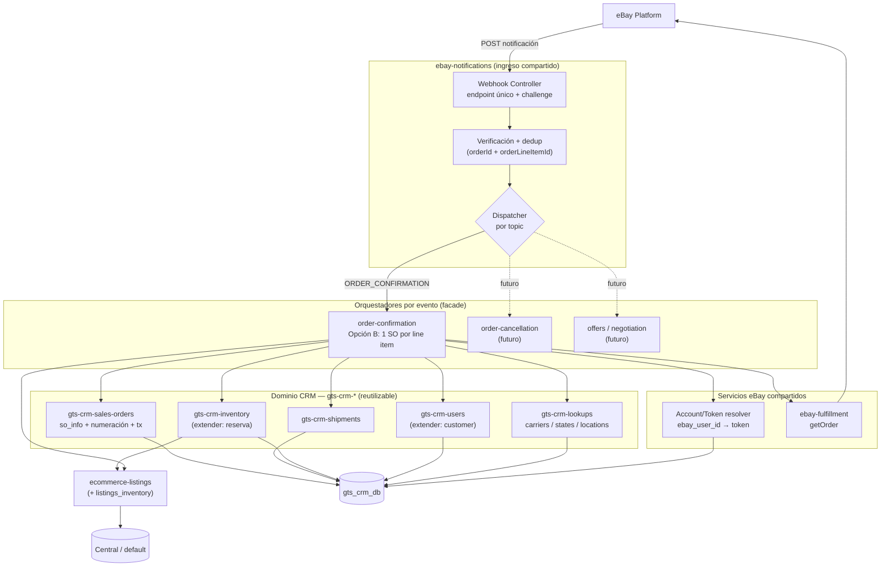

# Arquitectura del código — automatización de órdenes eBay

Guía de cómo organizar el código en `crm-api-nestjs/src/ecommerce/modules/` para que sea **reutilizable** cuando se agreguen más eventos de eBay (cancelación de órdenes, ofertas/negociación, etc.), y no una sola carpeta monolítica.

---

## Principios

1. **Separar tres responsabilidades** que cambian a ritmos distintos:
   - **Ingreso de eventos** (compartido por todos los eventos).
   - **Orquestadores por evento** (una feature = un orquestador).
   - **Dominio CRM** (servicios reutilizables que leen/escriben las tablas).
2. **El orquestador es un facade / application service:** por fuera se ve como "el proceso de órdenes", pero por dentro coordina servicios enfocados (uno para `so_info`, otro para `shipment`, otro para reserva de `inventory`, etc.), cada uno en su módulo.
3. **Un solo webhook** para todas las cuentas y topics; un *dispatcher* rutea por `topic` al orquestador correspondiente.
4. Lo único que se agrega por cada evento nuevo es su **orquestador**; el resto se reutiliza.

---

## Capas

| Capa | Módulos | Se comparte |
|---|---|---|
| **Ingreso** | `ebay-notifications` (endpoint único, challenge, verificación, dedup, dispatcher) | Todos los eventos |
| **Orquestadores (facade)** | `ebay-orders` (confirmación=Opción B; luego cancelación), `ebay-offers` (futuro) | No — uno por feature |
| **Servicios eBay compartidos** | `ebay-oauth` (resolver de token a nivel sistema), `ebay-fulfillment` (cliente Fulfillment) | Todos los eventos |
| **Dominio CRM (reutilizable)** | `gts-crm-sales-orders`, `gts-crm-shipments`, `gts-crm-lookups` (nuevos) + `gts-crm-inventory`, `gts-crm-users` (extender existentes) | Órdenes, cancelaciones, etc. |

> **Convención de prefijos** (consistente con el repo): `ebay-*` = concerns de la API de eBay · `ecommerce-*` = BD Central · `gts-crm-*` = BD del CRM (`gts_crm_db`). El prefijo indica a qué base de datos / dominio pertenece el módulo.
| **Lecturas Central** | `ecommerce-listings`, `ecommerce-listings_inventory` | Resolver rep y candidatos a reservar |

---

## Estructura de carpetas propuesta (`src/ecommerce/modules/`)

```
ebay-notifications/     ← INGRESO compartido: 1 endpoint, challenge, verificación,
                          dedup (orderId+orderLineItemId), dispatcher por topic
ebay-fulfillment/       ← cliente Fulfillment API (getOrder, …) [compartido]
ebay-orders/            ← ORQUESTADOR "órdenes" (confirmación = Opción B; luego cancelación)
ebay-offers/            ← (futuro) orquestador de ofertas / negociación

gts-crm-sales-orders/   ← dominio CRM: so_info (crear/void, numeración, transacción)
gts-crm-shipments/      ← dominio CRM: shipment (distinto del de buybacks)
gts-crm-lookups/        ← dominio CRM: carriers / states / locations

# Reutilizados / extendidos (ya existen):
gts-crm-inventory/             (extender: reservar / liberar inventory)
gts-crm-users/                 (extender: resolver / crear customer desde shipTo)
ebay-oauth/                    (+ método resolver a nivel sistema, sin userId humano)
ecommerce-listings/            (lectura Central: rep + candidatos a reservar)
ecommerce-listings_inventory/  (lectura Central)
```

---

## Diagrama



**Cómo leerlo:** el ingreso es único y compartido; el `dispatcher` rutea por topic al orquestador; el orquestador (facade) compone los servicios compartidos y de dominio; el dominio escribe en `gts_crm_db` y las lecturas de listings van a Central.

---

## Reutilización al agregar features nuevas

| Feature futura | Reutiliza | Agrega |
|---|---|---|
| **Cancelación de órdenes** | ingreso, token resolver, fulfillment, `gts-crm-sales-orders` (void), `gts-crm-inventory` (liberar) | orquestador de cancelación |
| **Ofertas / negociación** | ingreso*, token resolver, `gts-crm-lookups`, servicios de dominio según aplique | orquestador de ofertas (+ cliente Negotiation API) |

\* No todo evento futuro llega por webhook: la negociación de ofertas puede ser **pull** (Negotiation API). En ese caso el disparo no pasa por `ebay-notifications`, pero el orquestador reutiliza los mismos servicios de dominio.

---

## Relación con el resto de la documentación

- Flujo y decisiones del proceso: [`proceso.md`](proceso.md).
- Estrategia multi-line (Opción B): [`Manejo de multi-line-items.md`](Manejo%20de%20multi-line-items.md).
- Mapeo campo por campo: [`Mapeo de datos 1.md`](Mapeo%20de%20datos%201.md).
